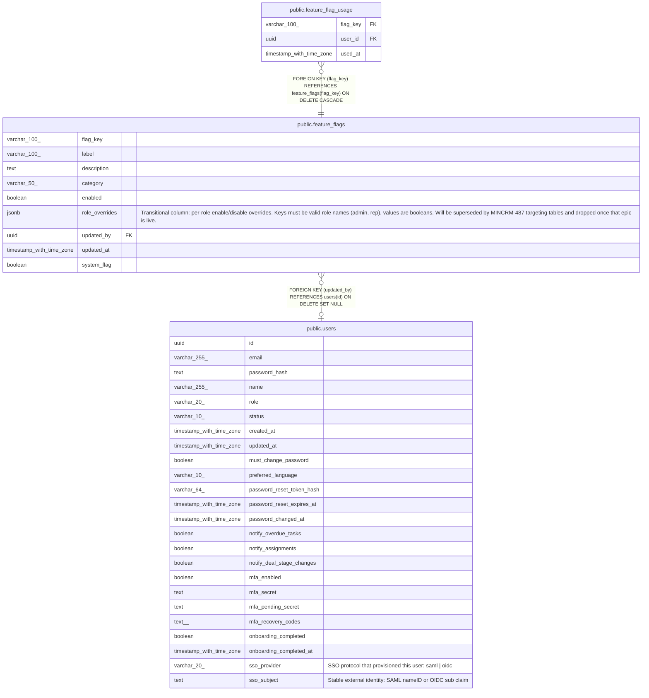

# public.feature_flags

## Columns

| Name | Type | Default | Nullable | Children | Parents | Comment |
| ---- | ---- | ------- | -------- | -------- | ------- | ------- |
| flag_key | varchar(100) |  | false | [public.feature_flag_usage](public.feature_flag_usage.md) |  |  |
| label | varchar(100) |  | false |  |  |  |
| description | text |  | false |  |  |  |
| category | varchar(50) |  | false |  |  |  |
| enabled | boolean | true | false |  |  |  |
| role_overrides | jsonb |  | true |  |  | Transitional column: per-role enable/disable overrides. Keys must be valid role names (admin, rep), values are booleans. Will be superseded by MINCRM-487 targeting tables and dropped once that epic is live. |
| updated_by | uuid |  | true |  | [public.users](public.users.md) |  |
| updated_at | timestamp with time zone | now() | false |  |  |  |
| system_flag | boolean | true | false |  |  |  |

## Constraints

| Name | Type | Definition |
| ---- | ---- | ---------- |
| feature_flags_role_overrides_valid_shape | CHECK | CHECK (is_valid_role_overrides(role_overrides)) |
| feature_flags_updated_by_fkey | FOREIGN KEY | FOREIGN KEY (updated_by) REFERENCES users(id) ON DELETE SET NULL |
| feature_flags_pkey | PRIMARY KEY | PRIMARY KEY (flag_key) |

## Indexes

| Name | Definition |
| ---- | ---------- |
| feature_flags_pkey | CREATE UNIQUE INDEX feature_flags_pkey ON public.feature_flags USING btree (flag_key) |
| feature_flags_category_index | CREATE INDEX feature_flags_category_index ON public.feature_flags USING btree (category) |

## Triggers

| Name | Definition |
| ---- | ---------- |
| feature_flags_set_updated_at | CREATE TRIGGER feature_flags_set_updated_at BEFORE UPDATE ON public.feature_flags FOR EACH ROW EXECUTE FUNCTION set_updated_at() |

## Relations

---

> Generated by [tbls](https://github.com/k1LoW/tbls)
