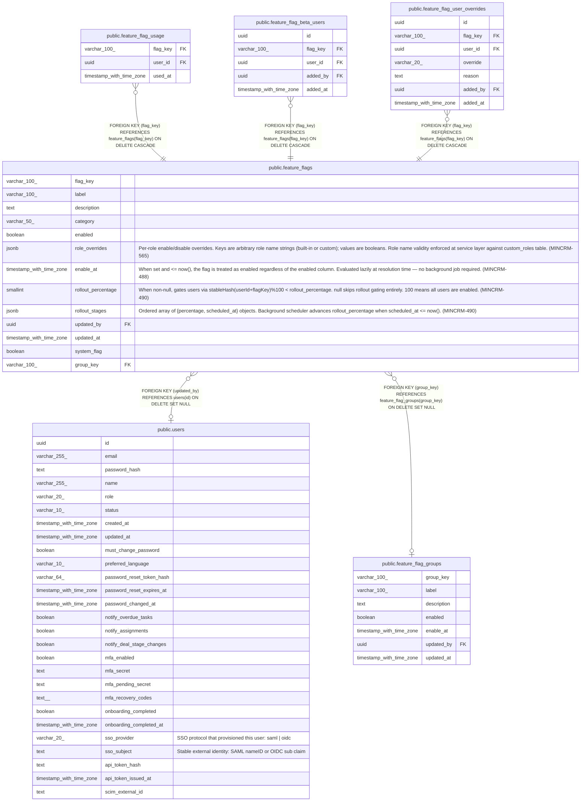

# public.feature_flags

## Columns

| Name | Type | Default | Nullable | Children | Parents | Comment |
| ---- | ---- | ------- | -------- | -------- | ------- | ------- |
| flag_key | varchar(100) |  | false | [public.feature_flag_usage](public.feature_flag_usage.md) [public.feature_flag_beta_users](public.feature_flag_beta_users.md) [public.feature_flag_user_overrides](public.feature_flag_user_overrides.md) |  |  |
| label | varchar(100) |  | false |  |  |  |
| description | text |  | false |  |  |  |
| category | varchar(50) |  | false |  |  |  |
| enabled | boolean | true | false |  |  |  |
| role_overrides | jsonb |  | true |  |  | Per-role enable/disable overrides. Keys are arbitrary role name strings (built-in or custom); values are booleans. Role name validity enforced at service layer against custom_roles table. (MINCRM-565) |
| enable_at | timestamp with time zone |  | true |  |  | When set and \<= now(), the flag is treated as enabled regardless of the enabled column. Evaluated lazily at resolution time — no background job required. (MINCRM-488) |
| rollout_percentage | smallint |  | true |  |  | When non-null, gates users via stableHash(userId+flagKey)%100 \< rollout_percentage. null skips rollout gating entirely. 100 means all users are enabled. (MINCRM-490) |
| rollout_stages | jsonb |  | true |  |  | Ordered array of {percentage, scheduled_at} objects. Background scheduler advances rollout_percentage when scheduled_at \<= now(). (MINCRM-490) |
| updated_by | uuid |  | true |  | [public.users](public.users.md) |  |
| updated_at | timestamp with time zone | now() | false |  |  |  |
| system_flag | boolean | true | false |  |  |  |
| group_key | varchar(100) |  | true |  | [public.feature_flag_groups](public.feature_flag_groups.md) |  |

## Constraints

| Name | Type | Definition |
| ---- | ---- | ---------- |
| feature_flags_role_overrides_valid_shape | CHECK | CHECK (is_valid_role_overrides(role_overrides)) |
| feature_flags_rollout_percentage_range | CHECK | CHECK (((rollout_percentage >= 0) AND (rollout_percentage <= 100))) |
| feature_flags_updated_by_fkey | FOREIGN KEY | FOREIGN KEY (updated_by) REFERENCES users(id) ON DELETE SET NULL |
| feature_flags_pkey | PRIMARY KEY | PRIMARY KEY (flag_key) |
| feature_flags_group_key_fkey | FOREIGN KEY | FOREIGN KEY (group_key) REFERENCES feature_flag_groups(group_key) ON DELETE SET NULL |

## Indexes

| Name | Definition |
| ---- | ---------- |
| feature_flags_pkey | CREATE UNIQUE INDEX feature_flags_pkey ON public.feature_flags USING btree (flag_key) |
| feature_flags_category_index | CREATE INDEX feature_flags_category_index ON public.feature_flags USING btree (category) |
| feature_flags_group_key_index | CREATE INDEX feature_flags_group_key_index ON public.feature_flags USING btree (group_key) |

## Triggers

| Name | Definition |
| ---- | ---------- |
| feature_flags_set_updated_at | CREATE TRIGGER feature_flags_set_updated_at BEFORE UPDATE ON public.feature_flags FOR EACH ROW EXECUTE FUNCTION set_updated_at() |

## Relations

---

> Generated by [tbls](https://github.com/k1LoW/tbls)
