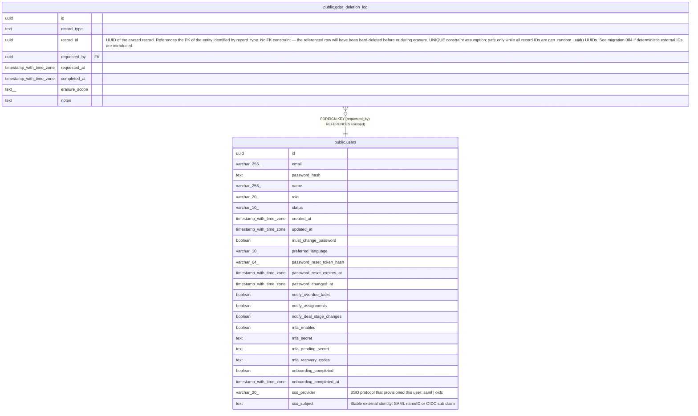

# public.gdpr_deletion_log

## Description

Append-only log of GDPR Art. 17 erasure requests (one row per erased record). The UNIQUE index on (record_type, record_id) is safe because all record_id values are UUIDs generated by gen_random_uuid() at row-creation time — re-imports always receive a new UUID. If deterministic external IDs are ever introduced this constraint must be revisited. See migration 084 for full rationale. (MINCRM-517) No FK constraint on record_id — the referenced row is hard-deleted during erasure. Rows are retained indefinitely by design; orphan cleanup does not apply. See CLAUDE.md — Polymorphic FK Pattern. (MINCRM-510)

## Columns

| Name | Type | Default | Nullable | Children | Parents | Comment |
| ---- | ---- | ------- | -------- | -------- | ------- | ------- |
| id | uuid | gen_random_uuid() | false |  |  |  |
| record_type | text |  | false |  |  |  |
| record_id | uuid |  | false |  |  | UUID of the erased record. References the PK of the entity identified by record_type. No FK constraint — the referenced row will have been hard-deleted before or during erasure. UNIQUE constraint assumption: safe only while all record IDs are gen_random_uuid() UUIDs. See migration 084 if deterministic external IDs are introduced. |
| requested_by | uuid |  | false |  | [public.users](public.users.md) |  |
| requested_at | timestamp with time zone | now() | false |  |  |  |
| completed_at | timestamp with time zone |  | true |  |  |  |
| erasure_scope | text[] |  | false |  |  |  |
| notes | text |  | true |  |  |  |

## Constraints

| Name | Type | Definition |
| ---- | ---- | ---------- |
| gdpr_deletion_log_requested_by_fkey | FOREIGN KEY | FOREIGN KEY (requested_by) REFERENCES users(id) |
| gdpr_deletion_log_pkey | PRIMARY KEY | PRIMARY KEY (id) |

## Indexes

| Name | Definition |
| ---- | ---------- |
| gdpr_deletion_log_pkey | CREATE UNIQUE INDEX gdpr_deletion_log_pkey ON public.gdpr_deletion_log USING btree (id) |
| gdpr_deletion_log_record_idx | CREATE UNIQUE INDEX gdpr_deletion_log_record_idx ON public.gdpr_deletion_log USING btree (record_type, record_id) |

## Relations

---

> Generated by [tbls](https://github.com/k1LoW/tbls)
