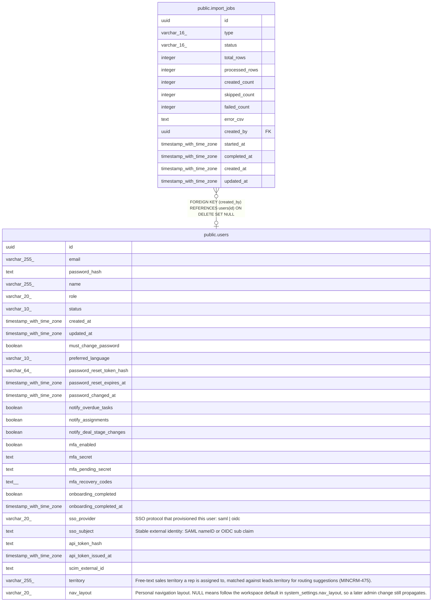

# public.import_jobs

## Columns

| Name | Type | Default | Nullable | Children | Parents | Comment |
| ---- | ---- | ------- | -------- | -------- | ------- | ------- |
| id | uuid | gen_random_uuid() | false |  |  |  |
| type | varchar(16) |  | false |  |  |  |
| status | varchar(16) | 'pending'::character varying | false |  |  |  |
| total_rows | integer |  | true |  |  |  |
| processed_rows | integer | 0 | false |  |  |  |
| created_count | integer | 0 | false |  |  |  |
| skipped_count | integer | 0 | false |  |  |  |
| failed_count | integer | 0 | false |  |  |  |
| error_csv | text |  | true |  |  |  |
| created_by | uuid |  | true |  | [public.users](public.users.md) |  |
| started_at | timestamp with time zone |  | true |  |  |  |
| completed_at | timestamp with time zone |  | true |  |  |  |
| created_at | timestamp with time zone | now() | false |  |  |  |
| updated_at | timestamp with time zone | now() | false |  |  |  |

## Constraints

| Name | Type | Definition |
| ---- | ---- | ---------- |
| import_jobs_created_by_fkey | FOREIGN KEY | FOREIGN KEY (created_by) REFERENCES users(id) ON DELETE SET NULL |
| import_jobs_pkey | PRIMARY KEY | PRIMARY KEY (id) |

## Indexes

| Name | Definition |
| ---- | ---------- |
| import_jobs_pkey | CREATE UNIQUE INDEX import_jobs_pkey ON public.import_jobs USING btree (id) |
| import_jobs_status_idx | CREATE INDEX import_jobs_status_idx ON public.import_jobs USING btree (status) |

## Triggers

| Name | Definition |
| ---- | ---------- |
| import_jobs_set_updated_at | CREATE TRIGGER import_jobs_set_updated_at BEFORE UPDATE ON public.import_jobs FOR EACH ROW EXECUTE FUNCTION set_updated_at() |

## Relations

---

> Generated by [tbls](https://github.com/k1LoW/tbls)
