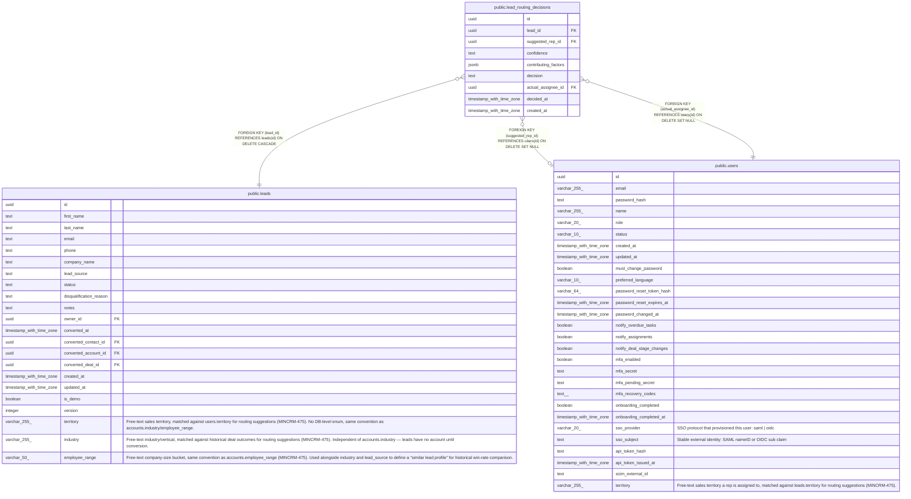

# public.lead_routing_decisions

## Description

One row per lead created after a routing suggestion was shown to the manager (MINCRM-475). Written once, at lead-creation time, in the same transaction as the lead insert — never updated. Doubles as the AC-required routing decision log. Leads created without ever requesting a suggestion have no row here.

## Columns

| Name | Type | Default | Nullable | Children | Parents | Comment |
| ---- | ---- | ------- | -------- | -------- | ------- | ------- |
| id | uuid | gen_random_uuid() | false |  |  |  |
| lead_id | uuid |  | false |  | [public.leads](public.leads.md) |  |
| suggested_rep_id | uuid |  | true |  | [public.users](public.users.md) |  |
| confidence | text |  | false |  |  |  |
| contributing_factors | jsonb | '[]'::jsonb | false |  |  |  |
| decision | text |  | false |  |  |  |
| actual_assignee_id | uuid |  | false |  | [public.users](public.users.md) |  |
| decided_at | timestamp with time zone |  | false |  |  |  |
| created_at | timestamp with time zone | now() | false |  |  |  |

## Constraints

| Name | Type | Definition |
| ---- | ---- | ---------- |
| lead_routing_decisions_confidence_check | CHECK | CHECK ((confidence = ANY (ARRAY['high'::text, 'medium'::text, 'low'::text]))) |
| lead_routing_decisions_decision_check | CHECK | CHECK ((decision = ANY (ARRAY['accepted'::text, 'overridden'::text]))) |
| lead_routing_decisions_actual_assignee_id_fkey | FOREIGN KEY | FOREIGN KEY (actual_assignee_id) REFERENCES users(id) ON DELETE SET NULL |
| lead_routing_decisions_suggested_rep_id_fkey | FOREIGN KEY | FOREIGN KEY (suggested_rep_id) REFERENCES users(id) ON DELETE SET NULL |
| lead_routing_decisions_lead_id_fkey | FOREIGN KEY | FOREIGN KEY (lead_id) REFERENCES leads(id) ON DELETE CASCADE |
| lead_routing_decisions_pkey | PRIMARY KEY | PRIMARY KEY (id) |

## Indexes

| Name | Definition |
| ---- | ---------- |
| lead_routing_decisions_pkey | CREATE UNIQUE INDEX lead_routing_decisions_pkey ON public.lead_routing_decisions USING btree (id) |
| lead_routing_decisions_lead_id_idx | CREATE INDEX lead_routing_decisions_lead_id_idx ON public.lead_routing_decisions USING btree (lead_id) |

## Relations

---

> Generated by [tbls](https://github.com/k1LoW/tbls)
