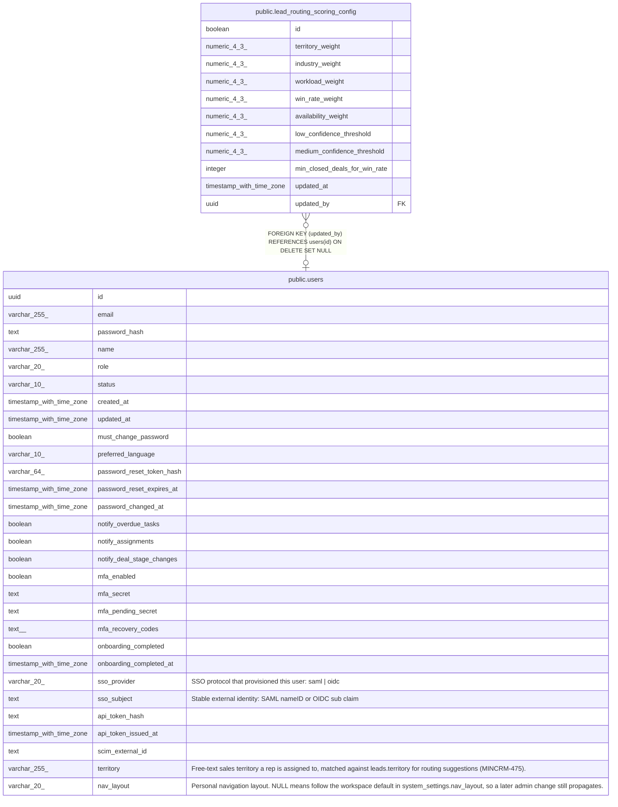

# public.lead_routing_scoring_config

## Description

Singleton admin-editable weights/thresholds for lead routing suggestion scoring (MINCRM-475). id is a boolean-typed singleton key (id = true) following the single-row-config convention (see account_health_scoring_config, migration 151; rep_coaching_scoring_config, migration 153).

## Columns

| Name | Type | Default | Nullable | Children | Parents | Comment |
| ---- | ---- | ------- | -------- | -------- | ------- | ------- |
| id | boolean | true | false |  |  |  |
| territory_weight | numeric(4,3) | 0.250 | false |  |  |  |
| industry_weight | numeric(4,3) | 0.250 | false |  |  |  |
| workload_weight | numeric(4,3) | 0.200 | false |  |  |  |
| win_rate_weight | numeric(4,3) | 0.200 | false |  |  |  |
| availability_weight | numeric(4,3) | 0.100 | false |  |  |  |
| low_confidence_threshold | numeric(4,3) | 0.400 | false |  |  |  |
| medium_confidence_threshold | numeric(4,3) | 0.650 | false |  |  |  |
| min_closed_deals_for_win_rate | integer | 3 | false |  |  |  |
| updated_at | timestamp with time zone | now() | false |  |  |  |
| updated_by | uuid |  | true |  | [public.users](public.users.md) |  |

## Constraints

| Name | Type | Definition |
| ---- | ---- | ---------- |
| lead_routing_scoring_config_min_closed_deals_check | CHECK | CHECK ((min_closed_deals_for_win_rate >= 1)) |
| lead_routing_scoring_config_singleton | CHECK | CHECK ((id = true)) |
| lead_routing_scoring_config_threshold_order_check | CHECK | CHECK ((medium_confidence_threshold > low_confidence_threshold)) |
| lead_routing_scoring_config_weights_sum_check | CHECK | CHECK (((((((territory_weight + industry_weight) + workload_weight) + win_rate_weight) + availability_weight) >= 0.999) AND (((((territory_weight + industry_weight) + workload_weight) + win_rate_weight) + availability_weight) <= 1.001))) |
| lead_routing_scoring_config_updated_by_fkey | FOREIGN KEY | FOREIGN KEY (updated_by) REFERENCES users(id) ON DELETE SET NULL |
| lead_routing_scoring_config_pkey | PRIMARY KEY | PRIMARY KEY (id) |

## Indexes

| Name | Definition |
| ---- | ---------- |
| lead_routing_scoring_config_pkey | CREATE UNIQUE INDEX lead_routing_scoring_config_pkey ON public.lead_routing_scoring_config USING btree (id) |

## Relations

---

> Generated by [tbls](https://github.com/k1LoW/tbls)
