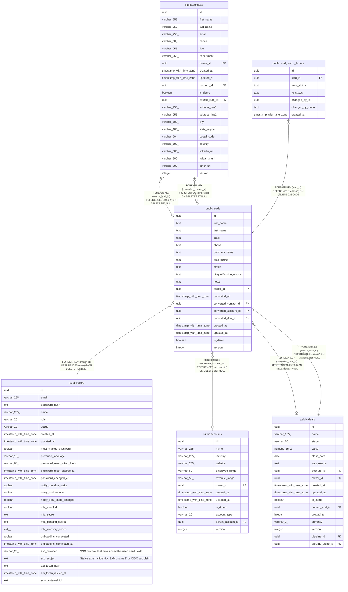

# public.leads

## Columns

| Name | Type | Default | Nullable | Children | Parents | Comment |
| ---- | ---- | ------- | -------- | -------- | ------- | ------- |
| id | uuid | gen_random_uuid() | false | [public.contacts](public.contacts.md) [public.deals](public.deals.md) [public.lead_status_history](public.lead_status_history.md) |  |  |
| first_name | text |  | false |  |  |  |
| last_name | text |  | true |  |  |  |
| email | text |  | false |  |  |  |
| phone | text |  | true |  |  |  |
| company_name | text |  | true |  |  |  |
| lead_source | text |  | true |  |  |  |
| status | text | 'New'::text | false |  |  |  |
| disqualification_reason | text |  | true |  |  |  |
| notes | text |  | true |  |  |  |
| owner_id | uuid |  | false |  | [public.users](public.users.md) |  |
| converted_at | timestamp with time zone |  | true |  |  |  |
| converted_contact_id | uuid |  | true |  | [public.contacts](public.contacts.md) |  |
| converted_account_id | uuid |  | true |  | [public.accounts](public.accounts.md) |  |
| converted_deal_id | uuid |  | true |  | [public.deals](public.deals.md) |  |
| created_at | timestamp with time zone | now() | false |  |  |  |
| updated_at | timestamp with time zone | now() | false |  |  |  |
| is_demo | boolean | false | false |  |  |  |
| version | integer | 1 | false |  |  |  |

## Constraints

| Name | Type | Definition |
| ---- | ---- | ---------- |
| leads_lead_source_check | CHECK | CHECK ((lead_source = ANY (ARRAY['Web'::text, 'Referral'::text, 'Trade Show'::text, 'Cold Outreach'::text, 'Other'::text]))) |
| leads_status_check | CHECK | CHECK ((status = ANY (ARRAY['New'::text, 'Contacted'::text, 'Qualified'::text, 'Disqualified'::text]))) |
| leads_owner_id_fkey | FOREIGN KEY | FOREIGN KEY (owner_id) REFERENCES users(id) ON DELETE RESTRICT |
| leads_pkey | PRIMARY KEY | PRIMARY KEY (id) |
| leads_converted_account_id_fkey | FOREIGN KEY | FOREIGN KEY (converted_account_id) REFERENCES accounts(id) ON DELETE SET NULL |
| leads_converted_contact_id_fkey | FOREIGN KEY | FOREIGN KEY (converted_contact_id) REFERENCES contacts(id) ON DELETE SET NULL |
| leads_converted_deal_id_fkey | FOREIGN KEY | FOREIGN KEY (converted_deal_id) REFERENCES deals(id) ON DELETE SET NULL |

## Indexes

| Name | Definition |
| ---- | ---------- |
| leads_pkey | CREATE UNIQUE INDEX leads_pkey ON public.leads USING btree (id) |
| leads_owner_id_index | CREATE INDEX leads_owner_id_index ON public.leads USING btree (owner_id) |
| leads_email_index | CREATE INDEX leads_email_index ON public.leads USING btree (email) |
| leads_status_index | CREATE INDEX leads_status_index ON public.leads USING btree (status) |
| leads_is_demo_index | CREATE INDEX leads_is_demo_index ON public.leads USING btree (is_demo) |
| leads_created_at_index | CREATE INDEX leads_created_at_index ON public.leads USING btree (created_at) |
| leads_converted_at_idx | CREATE INDEX leads_converted_at_idx ON public.leads USING btree (converted_at) WHERE (converted_at IS NOT NULL) |

## Triggers

| Name | Definition |
| ---- | ---------- |
| leads_set_updated_at | CREATE TRIGGER leads_set_updated_at BEFORE UPDATE ON public.leads FOR EACH ROW EXECUTE FUNCTION set_updated_at() |

## Relations

---

> Generated by [tbls](https://github.com/k1LoW/tbls)
