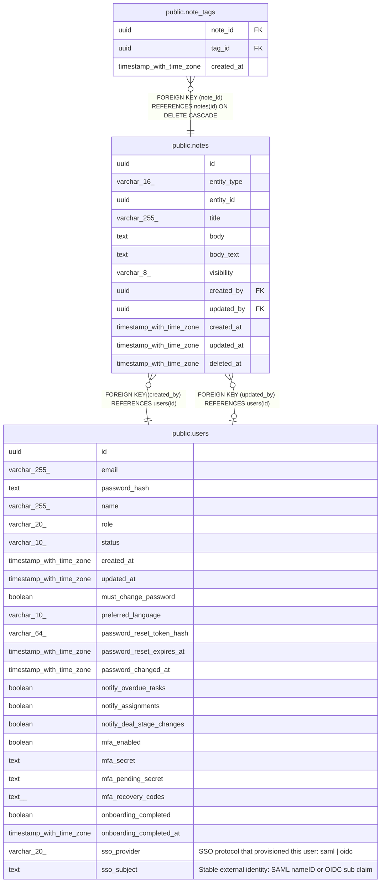

# public.notes

## Description

Rich notes attached to CRM entity records, with soft-delete support. entity_type + entity_id form a polymorphic reference — no FK constraint exists because PostgreSQL FKs cannot span multiple parent tables. Valid entity_type values: 'contact', 'account', 'deal', 'lead'. Soft-deleted rows (deleted_at IS NOT NULL) are excluded from application queries but remain in the table; the partial GIN index on body_text also excludes them. Hard orphan cleanup (rows whose entity_id no longer exists) is the application's responsibility. Soft-deleted orphans are harmless but may be purged by a periodic maintenance query. See CLAUDE.md — Polymorphic FK Pattern. (MINCRM-510)

## Columns

| Name | Type | Default | Nullable | Children | Parents | Comment |
| ---- | ---- | ------- | -------- | -------- | ------- | ------- |
| id | uuid | gen_random_uuid() | false | [public.note_tags](public.note_tags.md) |  |  |
| entity_type | varchar(16) |  | false |  |  |  |
| entity_id | uuid |  | false |  |  |  |
| title | varchar(255) |  | true |  |  |  |
| body | text |  | false |  |  |  |
| body_text | text |  | true |  |  |  |
| visibility | varchar(8) | 'team'::character varying | false |  |  |  |
| created_by | uuid |  | false |  | [public.users](public.users.md) |  |
| updated_by | uuid |  | true |  | [public.users](public.users.md) |  |
| created_at | timestamp with time zone | now() | false |  |  |  |
| updated_at | timestamp with time zone | now() | false |  |  |  |
| deleted_at | timestamp with time zone |  | true |  |  |  |

## Constraints

| Name | Type | Definition |
| ---- | ---- | ---------- |
| notes_entity_type_check | CHECK | CHECK (((entity_type)::text = ANY ((ARRAY['contact'::character varying, 'account'::character varying, 'deal'::character varying, 'lead'::character varying])::text[]))) |
| notes_visibility_check | CHECK | CHECK (((visibility)::text = ANY ((ARRAY['private'::character varying, 'team'::character varying, 'public'::character varying])::text[]))) |
| notes_created_by_fkey | FOREIGN KEY | FOREIGN KEY (created_by) REFERENCES users(id) |
| notes_updated_by_fkey | FOREIGN KEY | FOREIGN KEY (updated_by) REFERENCES users(id) |
| notes_pkey | PRIMARY KEY | PRIMARY KEY (id) |

## Indexes

| Name | Definition |
| ---- | ---------- |
| notes_pkey | CREATE UNIQUE INDEX notes_pkey ON public.notes USING btree (id) |
| notes_entity_idx | CREATE INDEX notes_entity_idx ON public.notes USING btree (entity_type, entity_id) |
| notes_created_by_idx | CREATE INDEX notes_created_by_idx ON public.notes USING btree (created_by) |
| notes_entity_active_idx | CREATE INDEX notes_entity_active_idx ON public.notes USING btree (entity_type, entity_id) WHERE (deleted_at IS NULL) |
| notes_body_text_trgm_idx | CREATE INDEX notes_body_text_trgm_idx ON public.notes USING gin (body_text gin_trgm_ops) WHERE (deleted_at IS NULL) |

## Triggers

| Name | Definition |
| ---- | ---------- |
| notes_set_updated_at | CREATE TRIGGER notes_set_updated_at BEFORE UPDATE ON public.notes FOR EACH ROW EXECUTE FUNCTION set_updated_at() |

## Relations

---

> Generated by [tbls](https://github.com/k1LoW/tbls)
