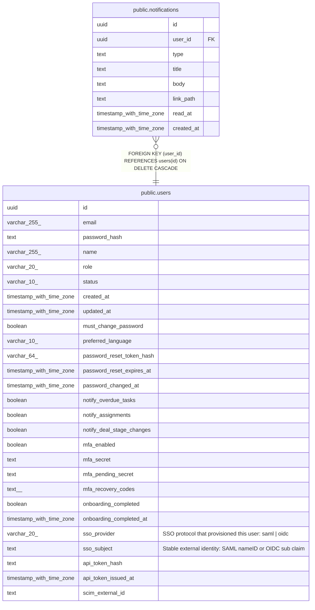

# public.notifications

## Description

Minimal in-app notification feed (MINCRM-469). type is free text (not a DB enum) so new notification-producing features can start writing rows without a migration, same convention as ai_token_usage_daily.feature.

## Columns

| Name | Type | Default | Nullable | Children | Parents | Comment |
| ---- | ---- | ------- | -------- | -------- | ------- | ------- |
| id | uuid | gen_random_uuid() | false |  |  |  |
| user_id | uuid |  | false |  | [public.users](public.users.md) |  |
| type | text |  | false |  |  |  |
| title | text |  | false |  |  |  |
| body | text |  | true |  |  |  |
| link_path | text |  | true |  |  |  |
| read_at | timestamp with time zone |  | true |  |  |  |
| created_at | timestamp with time zone | now() | false |  |  |  |

## Constraints

| Name | Type | Definition |
| ---- | ---- | ---------- |
| notifications_user_id_fkey | FOREIGN KEY | FOREIGN KEY (user_id) REFERENCES users(id) ON DELETE CASCADE |
| notifications_pkey | PRIMARY KEY | PRIMARY KEY (id) |

## Indexes

| Name | Definition |
| ---- | ---------- |
| notifications_pkey | CREATE UNIQUE INDEX notifications_pkey ON public.notifications USING btree (id) |
| notifications_user_id_created_at_idx | CREATE INDEX notifications_user_id_created_at_idx ON public.notifications USING btree (user_id, created_at DESC) |
| notifications_user_id_unread_idx | CREATE INDEX notifications_user_id_unread_idx ON public.notifications USING btree (user_id) WHERE (read_at IS NULL) |

## Relations

---

> Generated by [tbls](https://github.com/k1LoW/tbls)
