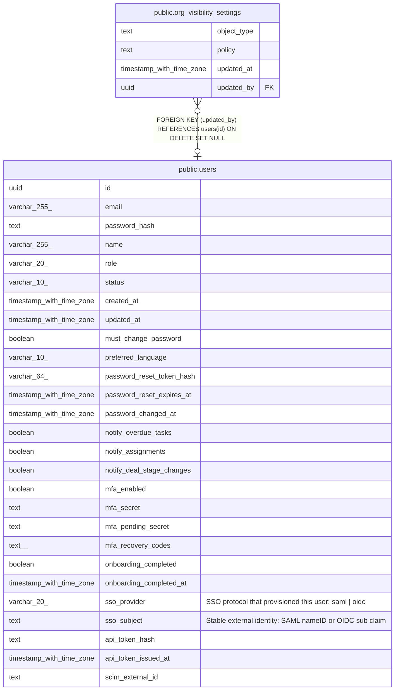

# public.org_visibility_settings

## Columns

| Name | Type | Default | Nullable | Children | Parents | Comment |
| ---- | ---- | ------- | -------- | -------- | ------- | ------- |
| object_type | text |  | false |  |  |  |
| policy | text | 'org'::text | false |  |  |  |
| updated_at | timestamp with time zone | now() | false |  |  |  |
| updated_by | uuid |  | true |  | [public.users](public.users.md) |  |

## Constraints

| Name | Type | Definition |
| ---- | ---- | ---------- |
| org_visibility_settings_object_type_check | CHECK | CHECK ((object_type = ANY (ARRAY['contact'::text, 'deal'::text, 'activity'::text]))) |
| org_visibility_settings_policy_check | CHECK | CHECK ((policy = ANY (ARRAY['private'::text, 'team'::text, 'org'::text]))) |
| org_visibility_settings_updated_by_fkey | FOREIGN KEY | FOREIGN KEY (updated_by) REFERENCES users(id) ON DELETE SET NULL |
| org_visibility_settings_pkey | PRIMARY KEY | PRIMARY KEY (object_type) |

## Indexes

| Name | Definition |
| ---- | ---------- |
| org_visibility_settings_pkey | CREATE UNIQUE INDEX org_visibility_settings_pkey ON public.org_visibility_settings USING btree (object_type) |

## Relations

---

> Generated by [tbls](https://github.com/k1LoW/tbls)
