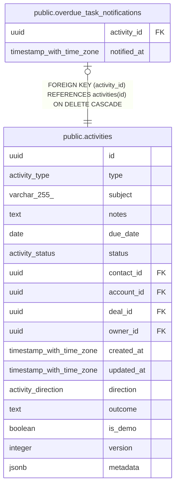

# public.overdue_task_notifications

## Columns

| Name | Type | Default | Nullable | Children | Parents | Comment |
| ---- | ---- | ------- | -------- | -------- | ------- | ------- |
| activity_id | uuid |  | false |  | [public.activities](public.activities.md) |  |
| notified_at | timestamp with time zone | now() | false |  |  |  |

## Constraints

| Name | Type | Definition |
| ---- | ---- | ---------- |
| overdue_task_notifications_activity_id_fkey | FOREIGN KEY | FOREIGN KEY (activity_id) REFERENCES activities(id) ON DELETE CASCADE |
| overdue_task_notifications_pkey | PRIMARY KEY | PRIMARY KEY (activity_id) |

## Indexes

| Name | Definition |
| ---- | ---------- |
| overdue_task_notifications_pkey | CREATE UNIQUE INDEX overdue_task_notifications_pkey ON public.overdue_task_notifications USING btree (activity_id) |

## Relations

---

> Generated by [tbls](https://github.com/k1LoW/tbls)
