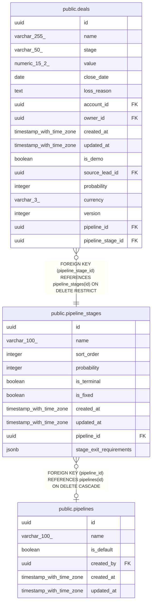

# public.pipeline_stages

## Columns

| Name | Type | Default | Nullable | Children | Parents | Comment |
| ---- | ---- | ------- | -------- | -------- | ------- | ------- |
| id | uuid | gen_random_uuid() | false | [public.deals](public.deals.md) |  |  |
| name | varchar(100) |  | false |  |  |  |
| sort_order | integer |  | false |  |  |  |
| probability | integer | 0 | false |  |  |  |
| is_terminal | boolean | false | false |  |  |  |
| is_fixed | boolean | false | false |  |  |  |
| created_at | timestamp with time zone | now() | false |  |  |  |
| updated_at | timestamp with time zone | now() | false |  |  |  |
| pipeline_id | uuid |  | true |  | [public.pipelines](public.pipelines.md) |  |
| stage_exit_requirements | jsonb | '{}'::jsonb | false |  |  |  |

## Constraints

| Name | Type | Definition |
| ---- | ---- | ---------- |
| pipeline_stages_probability_check | CHECK | CHECK (((probability >= 0) AND (probability <= 100))) |
| pipeline_stages_pkey | PRIMARY KEY | PRIMARY KEY (id) |
| pipeline_stages_pipeline_id_fkey | FOREIGN KEY | FOREIGN KEY (pipeline_id) REFERENCES pipelines(id) ON DELETE CASCADE |

## Indexes

| Name | Definition |
| ---- | ---------- |
| pipeline_stages_pkey | CREATE UNIQUE INDEX pipeline_stages_pkey ON public.pipeline_stages USING btree (id) |
| pipeline_stages_pipeline_sort_order_unique | CREATE UNIQUE INDEX pipeline_stages_pipeline_sort_order_unique ON public.pipeline_stages USING btree (pipeline_id, sort_order) |
| pipeline_stages_pipeline_name_lower_unique | CREATE UNIQUE INDEX pipeline_stages_pipeline_name_lower_unique ON public.pipeline_stages USING btree (pipeline_id, lower((name)::text)) |

## Triggers

| Name | Definition |
| ---- | ---------- |
| pipeline_stages_set_updated_at | CREATE TRIGGER pipeline_stages_set_updated_at BEFORE UPDATE ON public.pipeline_stages FOR EACH ROW EXECUTE FUNCTION set_updated_at() |

## Relations

---

> Generated by [tbls](https://github.com/k1LoW/tbls)
