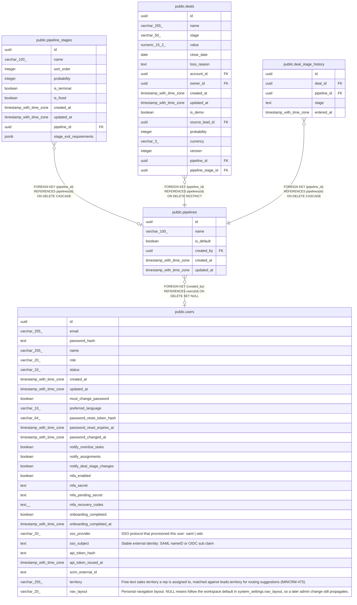

# public.pipelines

## Columns

| Name | Type | Default | Nullable | Children | Parents | Comment |
| ---- | ---- | ------- | -------- | -------- | ------- | ------- |
| id | uuid | gen_random_uuid() | false | [public.pipeline_stages](public.pipeline_stages.md) [public.deals](public.deals.md) [public.deal_stage_history](public.deal_stage_history.md) |  |  |
| name | varchar(100) |  | false |  |  |  |
| is_default | boolean | false | false |  |  |  |
| created_by | uuid |  | true |  | [public.users](public.users.md) |  |
| created_at | timestamp with time zone | now() | false |  |  |  |
| updated_at | timestamp with time zone | now() | false |  |  |  |

## Constraints

| Name | Type | Definition |
| ---- | ---- | ---------- |
| pipelines_created_by_fkey | FOREIGN KEY | FOREIGN KEY (created_by) REFERENCES users(id) ON DELETE SET NULL |
| pipelines_pkey | PRIMARY KEY | PRIMARY KEY (id) |

## Indexes

| Name | Definition |
| ---- | ---------- |
| pipelines_pkey | CREATE UNIQUE INDEX pipelines_pkey ON public.pipelines USING btree (id) |
| pipelines_name_lower_unique | CREATE UNIQUE INDEX pipelines_name_lower_unique ON public.pipelines USING btree (lower((name)::text)) |
| pipelines_single_default_idx | CREATE UNIQUE INDEX pipelines_single_default_idx ON public.pipelines USING btree (is_default) WHERE (is_default = true) |

## Triggers

| Name | Definition |
| ---- | ---------- |
| pipelines_set_updated_at | CREATE TRIGGER pipelines_set_updated_at BEFORE UPDATE ON public.pipelines FOR EACH ROW EXECUTE FUNCTION set_updated_at() |

## Relations

---

> Generated by [tbls](https://github.com/k1LoW/tbls)
