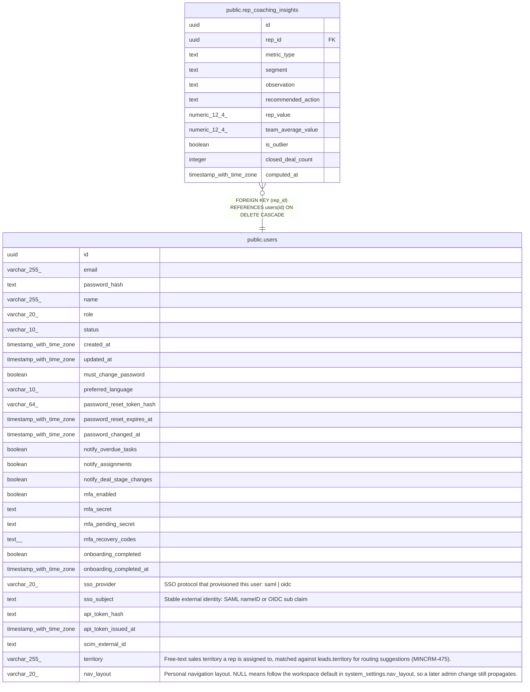

# public.rep_coaching_insights

## Description

Current cached per-rep coaching insight per metric (MINCRM-474). Upserted nightly by repCoachingService; the read path never computes live. Absence of rows for a rep means fewer than min_closed_deals closed deals. Never exposed as an NLI tool — read exclusively via the dedicated /insights/coaching and dashboard endpoints, gated by role, to protect rep privacy.

## Columns

| Name | Type | Default | Nullable | Children | Parents | Comment |
| ---- | ---- | ------- | -------- | -------- | ------- | ------- |
| id | uuid | gen_random_uuid() | false |  |  |  |
| rep_id | uuid |  | false |  | [public.users](public.users.md) |  |
| metric_type | text |  | false |  |  |  |
| segment | text | ''::text | false |  |  |  |
| observation | text |  | false |  |  |  |
| recommended_action | text |  | false |  |  |  |
| rep_value | numeric(12,4) |  | false |  |  |  |
| team_average_value | numeric(12,4) |  | false |  |  |  |
| is_outlier | boolean | false | false |  |  |  |
| closed_deal_count | integer |  | false |  |  |  |
| computed_at | timestamp with time zone | now() | false |  |  |  |

## Constraints

| Name | Type | Definition |
| ---- | ---- | ---------- |
| rep_coaching_insights_closed_deal_count_check | CHECK | CHECK ((closed_deal_count >= 0)) |
| rep_coaching_insights_rep_id_fkey | FOREIGN KEY | FOREIGN KEY (rep_id) REFERENCES users(id) ON DELETE CASCADE |
| rep_coaching_insights_pkey | PRIMARY KEY | PRIMARY KEY (id) |
| rep_coaching_insights_rep_metric_segment_unique | UNIQUE | UNIQUE (rep_id, metric_type, segment) |

## Indexes

| Name | Definition |
| ---- | ---------- |
| rep_coaching_insights_pkey | CREATE UNIQUE INDEX rep_coaching_insights_pkey ON public.rep_coaching_insights USING btree (id) |
| rep_coaching_insights_rep_metric_segment_unique | CREATE UNIQUE INDEX rep_coaching_insights_rep_metric_segment_unique ON public.rep_coaching_insights USING btree (rep_id, metric_type, segment) |
| rep_coaching_insights_rep_id_idx | CREATE INDEX rep_coaching_insights_rep_id_idx ON public.rep_coaching_insights USING btree (rep_id) |

## Relations

---

> Generated by [tbls](https://github.com/k1LoW/tbls)
