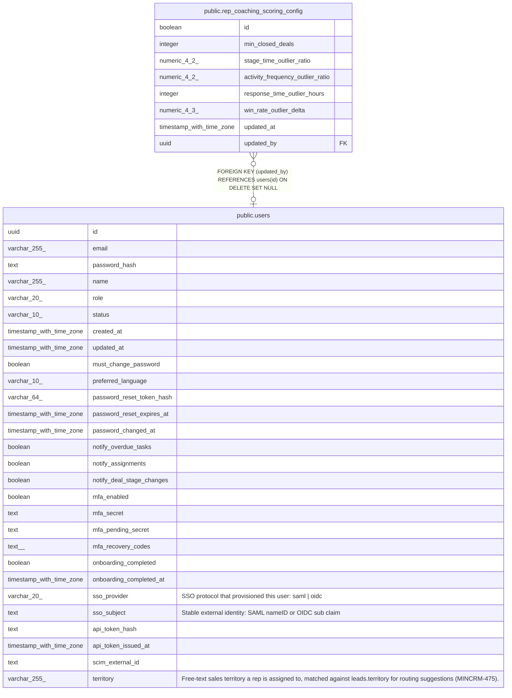

# public.rep_coaching_scoring_config

## Description

Singleton admin-editable thresholds for rep coaching insight generation (MINCRM-474). id is a boolean-typed singleton key (id = true) following the single-row-config convention (see account_health_scoring_config, migration 151).

## Columns

| Name | Type | Default | Nullable | Children | Parents | Comment |
| ---- | ---- | ------- | -------- | -------- | ------- | ------- |
| id | boolean | true | false |  |  |  |
| min_closed_deals | integer | 10 | false |  |  |  |
| stage_time_outlier_ratio | numeric(4,2) | 1.50 | false |  |  |  |
| activity_frequency_outlier_ratio | numeric(4,2) | 0.50 | false |  |  |  |
| response_time_outlier_hours | integer | 48 | false |  |  |  |
| win_rate_outlier_delta | numeric(4,3) | 0.150 | false |  |  |  |
| updated_at | timestamp with time zone | now() | false |  |  |  |
| updated_by | uuid |  | true |  | [public.users](public.users.md) |  |

## Constraints

| Name | Type | Definition |
| ---- | ---- | ---------- |
| rep_coaching_scoring_config_activity_ratio_check | CHECK | CHECK (((activity_frequency_outlier_ratio > (0)::numeric) AND (activity_frequency_outlier_ratio < (1)::numeric))) |
| rep_coaching_scoring_config_min_closed_deals_check | CHECK | CHECK ((min_closed_deals >= 1)) |
| rep_coaching_scoring_config_response_hours_check | CHECK | CHECK ((response_time_outlier_hours >= 1)) |
| rep_coaching_scoring_config_singleton | CHECK | CHECK ((id = true)) |
| rep_coaching_scoring_config_stage_ratio_check | CHECK | CHECK ((stage_time_outlier_ratio > (1)::numeric)) |
| rep_coaching_scoring_config_win_rate_delta_check | CHECK | CHECK (((win_rate_outlier_delta > (0)::numeric) AND (win_rate_outlier_delta < (1)::numeric))) |
| rep_coaching_scoring_config_updated_by_fkey | FOREIGN KEY | FOREIGN KEY (updated_by) REFERENCES users(id) ON DELETE SET NULL |
| rep_coaching_scoring_config_pkey | PRIMARY KEY | PRIMARY KEY (id) |

## Indexes

| Name | Definition |
| ---- | ---------- |
| rep_coaching_scoring_config_pkey | CREATE UNIQUE INDEX rep_coaching_scoring_config_pkey ON public.rep_coaching_scoring_config USING btree (id) |

## Relations

---

> Generated by [tbls](https://github.com/k1LoW/tbls)
