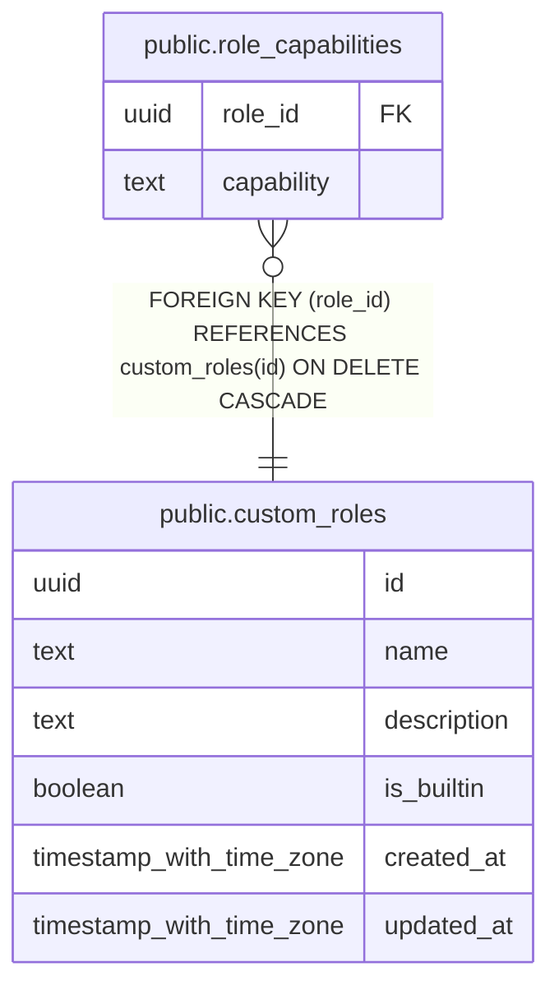

# public.role_capabilities

## Description

Capability strings granted to a role (MINCRM-542). The TypeScript Capability enum in shared/schemas/capabilitySchema.ts is the source of truth for valid capability strings — the DB stores assignments only. A capability absent from this table means the role does not have it.

## Columns

| Name | Type | Default | Nullable | Children | Parents | Comment |
| ---- | ---- | ------- | -------- | -------- | ------- | ------- |
| role_id | uuid |  | false |  | [public.custom_roles](public.custom_roles.md) |  |
| capability | text |  | false |  |  |  |

## Constraints

| Name | Type | Definition |
| ---- | ---- | ---------- |
| role_capabilities_role_id_fkey | FOREIGN KEY | FOREIGN KEY (role_id) REFERENCES custom_roles(id) ON DELETE CASCADE |
| role_capabilities_pkey | PRIMARY KEY | PRIMARY KEY (role_id, capability) |

## Indexes

| Name | Definition |
| ---- | ---------- |
| role_capabilities_pkey | CREATE UNIQUE INDEX role_capabilities_pkey ON public.role_capabilities USING btree (role_id, capability) |
| role_capabilities_role_id_idx | CREATE INDEX role_capabilities_role_id_idx ON public.role_capabilities USING btree (role_id) |

## Relations

---

> Generated by [tbls](https://github.com/k1LoW/tbls)
