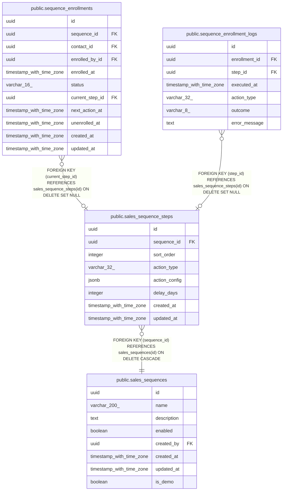

# public.sales_sequence_steps

## Columns

| Name | Type | Default | Nullable | Children | Parents | Comment |
| ---- | ---- | ------- | -------- | -------- | ------- | ------- |
| id | uuid | gen_random_uuid() | false | [public.sequence_enrollments](public.sequence_enrollments.md) [public.sequence_enrollment_logs](public.sequence_enrollment_logs.md) |  |  |
| sequence_id | uuid |  | false |  | [public.sales_sequences](public.sales_sequences.md) |  |
| sort_order | integer |  | false |  |  |  |
| action_type | varchar(32) |  | false |  |  |  |
| action_config | jsonb | '{}'::jsonb | false |  |  |  |
| delay_days | integer | 0 | false |  |  |  |
| created_at | timestamp with time zone | now() | false |  |  |  |
| updated_at | timestamp with time zone | now() | false |  |  |  |

## Constraints

| Name | Type | Definition |
| ---- | ---- | ---------- |
| sales_sequence_steps_action_type_check | CHECK | CHECK (((action_type)::text = ANY (ARRAY[('send_email'::character varying)::text, ('log_call_reminder'::character varying)::text, ('create_task'::character varying)::text]))) |
| sales_sequence_steps_delay_days_check | CHECK | CHECK ((delay_days >= 0)) |
| sales_sequence_steps_sequence_id_fkey | FOREIGN KEY | FOREIGN KEY (sequence_id) REFERENCES sales_sequences(id) ON DELETE CASCADE |
| sales_sequence_steps_pkey | PRIMARY KEY | PRIMARY KEY (id) |
| uq_sequence_sort_order | UNIQUE | UNIQUE (sequence_id, sort_order) |

## Indexes

| Name | Definition |
| ---- | ---------- |
| sales_sequence_steps_pkey | CREATE UNIQUE INDEX sales_sequence_steps_pkey ON public.sales_sequence_steps USING btree (id) |
| uq_sequence_sort_order | CREATE UNIQUE INDEX uq_sequence_sort_order ON public.sales_sequence_steps USING btree (sequence_id, sort_order) |
| sales_sequence_steps_sequence_id_index | CREATE INDEX sales_sequence_steps_sequence_id_index ON public.sales_sequence_steps USING btree (sequence_id) |

## Triggers

| Name | Definition |
| ---- | ---------- |
| sales_sequence_steps_set_updated_at | CREATE TRIGGER sales_sequence_steps_set_updated_at BEFORE UPDATE ON public.sales_sequence_steps FOR EACH ROW EXECUTE FUNCTION set_updated_at() |

## Relations

---

> Generated by [tbls](https://github.com/k1LoW/tbls)
