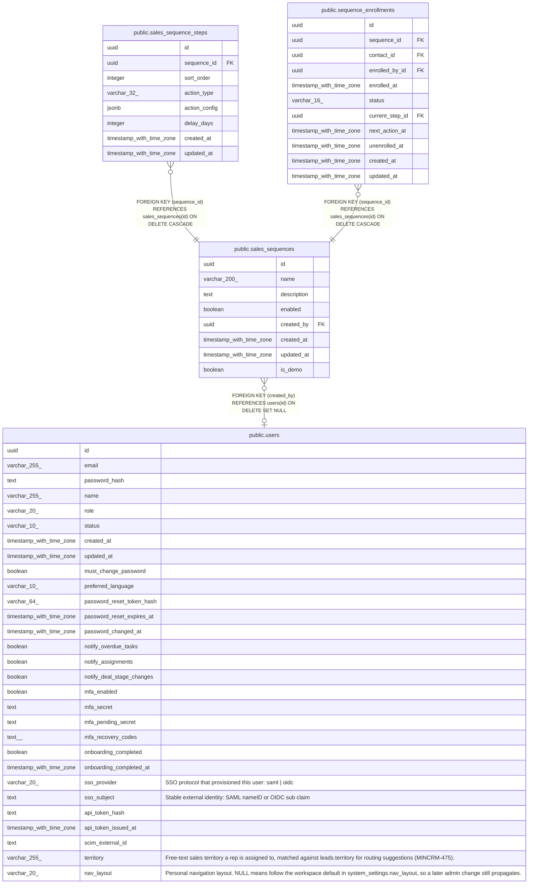

# public.sales_sequences

## Columns

| Name | Type | Default | Nullable | Children | Parents | Comment |
| ---- | ---- | ------- | -------- | -------- | ------- | ------- |
| id | uuid | gen_random_uuid() | false | [public.sales_sequence_steps](public.sales_sequence_steps.md) [public.sequence_enrollments](public.sequence_enrollments.md) |  |  |
| name | varchar(200) |  | false |  |  |  |
| description | text |  | true |  |  |  |
| enabled | boolean | true | false |  |  |  |
| created_by | uuid |  | true |  | [public.users](public.users.md) |  |
| created_at | timestamp with time zone | now() | false |  |  |  |
| updated_at | timestamp with time zone | now() | false |  |  |  |
| is_demo | boolean | false | false |  |  |  |

## Constraints

| Name | Type | Definition |
| ---- | ---- | ---------- |
| sales_sequences_created_by_fkey | FOREIGN KEY | FOREIGN KEY (created_by) REFERENCES users(id) ON DELETE SET NULL |
| sales_sequences_pkey | PRIMARY KEY | PRIMARY KEY (id) |

## Indexes

| Name | Definition |
| ---- | ---------- |
| sales_sequences_pkey | CREATE UNIQUE INDEX sales_sequences_pkey ON public.sales_sequences USING btree (id) |
| sales_sequences_created_by_index | CREATE INDEX sales_sequences_created_by_index ON public.sales_sequences USING btree (created_by) |

## Triggers

| Name | Definition |
| ---- | ---------- |
| sales_sequences_set_updated_at | CREATE TRIGGER sales_sequences_set_updated_at BEFORE UPDATE ON public.sales_sequences FOR EACH ROW EXECUTE FUNCTION set_updated_at() |

## Relations

---

> Generated by [tbls](https://github.com/k1LoW/tbls)
