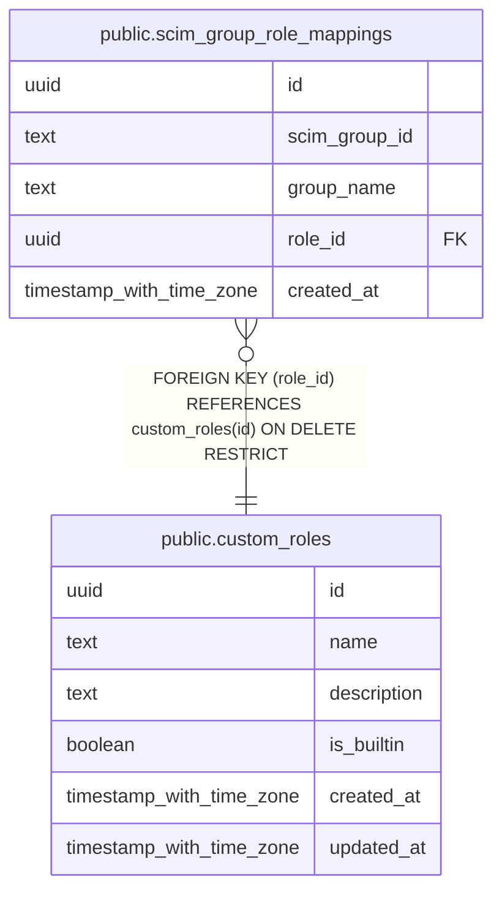

# public.scim_group_role_mappings

## Columns

| Name | Type | Default | Nullable | Children | Parents | Comment |
| ---- | ---- | ------- | -------- | -------- | ------- | ------- |
| id | uuid | gen_random_uuid() | false |  |  |  |
| scim_group_id | text |  | false |  |  |  |
| group_name | text |  | false |  |  |  |
| role_id | uuid |  | false |  | [public.custom_roles](public.custom_roles.md) |  |
| created_at | timestamp with time zone | now() | false |  |  |  |

## Constraints

| Name | Type | Definition |
| ---- | ---- | ---------- |
| scim_group_role_mappings_role_id_fkey | FOREIGN KEY | FOREIGN KEY (role_id) REFERENCES custom_roles(id) ON DELETE RESTRICT |
| scim_group_role_mappings_pkey | PRIMARY KEY | PRIMARY KEY (id) |
| scim_group_role_mappings_scim_group_id_key | UNIQUE | UNIQUE (scim_group_id) |

## Indexes

| Name | Definition |
| ---- | ---------- |
| scim_group_role_mappings_pkey | CREATE UNIQUE INDEX scim_group_role_mappings_pkey ON public.scim_group_role_mappings USING btree (id) |
| scim_group_role_mappings_scim_group_id_key | CREATE UNIQUE INDEX scim_group_role_mappings_scim_group_id_key ON public.scim_group_role_mappings USING btree (scim_group_id) |

## Relations

---

> Generated by [tbls](https://github.com/k1LoW/tbls)
