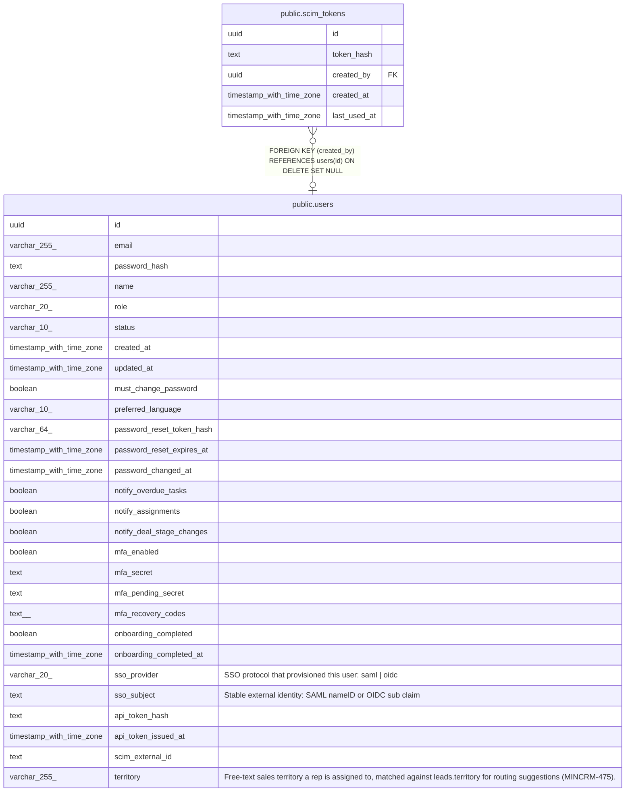

# public.scim_tokens

## Columns

| Name | Type | Default | Nullable | Children | Parents | Comment |
| ---- | ---- | ------- | -------- | -------- | ------- | ------- |
| id | uuid | gen_random_uuid() | false |  |  |  |
| token_hash | text |  | false |  |  |  |
| created_by | uuid |  | true |  | [public.users](public.users.md) |  |
| created_at | timestamp with time zone | now() | false |  |  |  |
| last_used_at | timestamp with time zone |  | true |  |  |  |

## Constraints

| Name | Type | Definition |
| ---- | ---- | ---------- |
| scim_tokens_created_by_fkey | FOREIGN KEY | FOREIGN KEY (created_by) REFERENCES users(id) ON DELETE SET NULL |
| scim_tokens_pkey | PRIMARY KEY | PRIMARY KEY (id) |
| scim_tokens_token_hash_key | UNIQUE | UNIQUE (token_hash) |

## Indexes

| Name | Definition |
| ---- | ---------- |
| scim_tokens_pkey | CREATE UNIQUE INDEX scim_tokens_pkey ON public.scim_tokens USING btree (id) |
| scim_tokens_token_hash_key | CREATE UNIQUE INDEX scim_tokens_token_hash_key ON public.scim_tokens USING btree (token_hash) |

## Relations

---

> Generated by [tbls](https://github.com/k1LoW/tbls)
