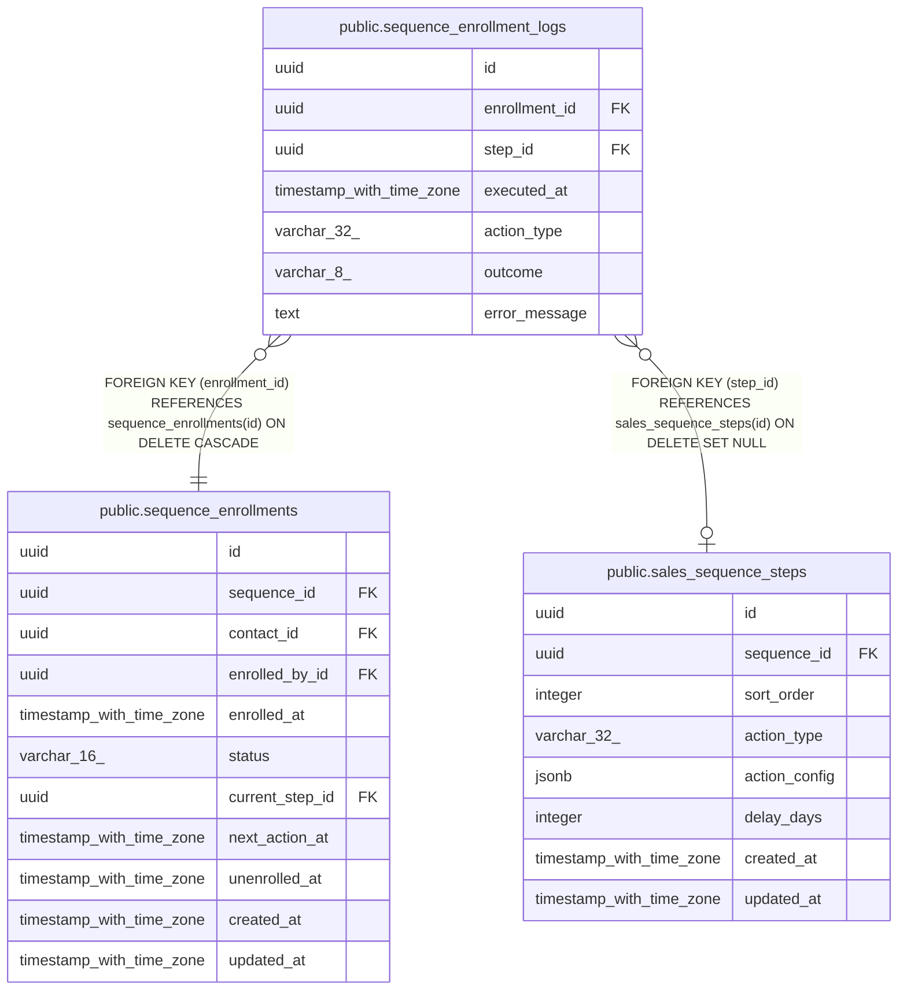

# public.sequence_enrollment_logs

## Columns

| Name | Type | Default | Nullable | Children | Parents | Comment |
| ---- | ---- | ------- | -------- | -------- | ------- | ------- |
| id | uuid | gen_random_uuid() | false |  |  |  |
| enrollment_id | uuid |  | false |  | [public.sequence_enrollments](public.sequence_enrollments.md) |  |
| step_id | uuid |  | true |  | [public.sales_sequence_steps](public.sales_sequence_steps.md) |  |
| executed_at | timestamp with time zone | now() | false |  |  |  |
| action_type | varchar(32) |  | false |  |  |  |
| outcome | varchar(8) |  | false |  |  |  |
| error_message | text |  | true |  |  |  |

## Constraints

| Name | Type | Definition |
| ---- | ---- | ---------- |
| sequence_enrollment_logs_outcome_check | CHECK | CHECK (((outcome)::text = ANY ((ARRAY['success'::character varying, 'skipped'::character varying, 'error'::character varying])::text[]))) |
| sequence_enrollment_logs_step_id_fkey | FOREIGN KEY | FOREIGN KEY (step_id) REFERENCES sales_sequence_steps(id) ON DELETE SET NULL |
| sequence_enrollment_logs_enrollment_id_fkey | FOREIGN KEY | FOREIGN KEY (enrollment_id) REFERENCES sequence_enrollments(id) ON DELETE CASCADE |
| sequence_enrollment_logs_pkey | PRIMARY KEY | PRIMARY KEY (id) |

## Indexes

| Name | Definition |
| ---- | ---------- |
| sequence_enrollment_logs_pkey | CREATE UNIQUE INDEX sequence_enrollment_logs_pkey ON public.sequence_enrollment_logs USING btree (id) |
| sequence_enrollment_logs_enrollment_id_index | CREATE INDEX sequence_enrollment_logs_enrollment_id_index ON public.sequence_enrollment_logs USING btree (enrollment_id) |
| sequence_enrollment_logs_executed_at_idx | CREATE INDEX sequence_enrollment_logs_executed_at_idx ON public.sequence_enrollment_logs USING btree (executed_at) |

## Relations

---

> Generated by [tbls](https://github.com/k1LoW/tbls)
