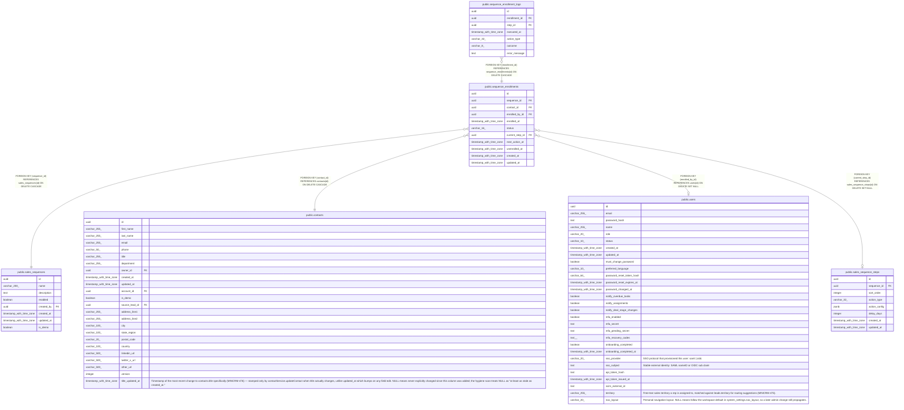

# public.sequence_enrollments

## Columns

| Name | Type | Default | Nullable | Children | Parents | Comment |
| ---- | ---- | ------- | -------- | -------- | ------- | ------- |
| id | uuid | gen_random_uuid() | false | [public.sequence_enrollment_logs](public.sequence_enrollment_logs.md) |  |  |
| sequence_id | uuid |  | false |  | [public.sales_sequences](public.sales_sequences.md) |  |
| contact_id | uuid |  | false |  | [public.contacts](public.contacts.md) |  |
| enrolled_by_id | uuid |  | true |  | [public.users](public.users.md) |  |
| enrolled_at | timestamp with time zone | now() | false |  |  |  |
| status | varchar(16) | '''active'''::character varying | false |  |  |  |
| current_step_id | uuid |  | true |  | [public.sales_sequence_steps](public.sales_sequence_steps.md) |  |
| next_action_at | timestamp with time zone |  | true |  |  |  |
| unenrolled_at | timestamp with time zone |  | true |  |  |  |
| created_at | timestamp with time zone | now() | false |  |  |  |
| updated_at | timestamp with time zone | now() | false |  |  |  |

## Constraints

| Name | Type | Definition |
| ---- | ---- | ---------- |
| sequence_enrollments_status_check | CHECK | CHECK (((status)::text = ANY (ARRAY[('active'::character varying)::text, ('completed'::character varying)::text, ('unenrolled'::character varying)::text]))) |
| sequence_enrollments_enrolled_by_id_fkey | FOREIGN KEY | FOREIGN KEY (enrolled_by_id) REFERENCES users(id) ON DELETE SET NULL |
| sequence_enrollments_contact_id_fkey | FOREIGN KEY | FOREIGN KEY (contact_id) REFERENCES contacts(id) ON DELETE CASCADE |
| sequence_enrollments_sequence_id_fkey | FOREIGN KEY | FOREIGN KEY (sequence_id) REFERENCES sales_sequences(id) ON DELETE CASCADE |
| sequence_enrollments_current_step_id_fkey | FOREIGN KEY | FOREIGN KEY (current_step_id) REFERENCES sales_sequence_steps(id) ON DELETE SET NULL |
| sequence_enrollments_pkey | PRIMARY KEY | PRIMARY KEY (id) |

## Indexes

| Name | Definition |
| ---- | ---------- |
| sequence_enrollments_pkey | CREATE UNIQUE INDEX sequence_enrollments_pkey ON public.sequence_enrollments USING btree (id) |
| sequence_enrollments_sequence_id_index | CREATE INDEX sequence_enrollments_sequence_id_index ON public.sequence_enrollments USING btree (sequence_id) |
| sequence_enrollments_contact_id_index | CREATE INDEX sequence_enrollments_contact_id_index ON public.sequence_enrollments USING btree (contact_id) |
| sequence_enrollments_next_action_at_index | CREATE INDEX sequence_enrollments_next_action_at_index ON public.sequence_enrollments USING btree (next_action_at) |
| sequence_enrollments_status_next_action_idx | CREATE INDEX sequence_enrollments_status_next_action_idx ON public.sequence_enrollments USING btree (next_action_at) WHERE ((status)::text = 'active'::text) |
| uq_active_enrollment | CREATE UNIQUE INDEX uq_active_enrollment ON public.sequence_enrollments USING btree (sequence_id, contact_id) WHERE ((status)::text = 'active'::text) |

## Triggers

| Name | Definition |
| ---- | ---------- |
| sequence_enrollments_set_updated_at | CREATE TRIGGER sequence_enrollments_set_updated_at BEFORE UPDATE ON public.sequence_enrollments FOR EACH ROW EXECUTE FUNCTION set_updated_at() |

## Relations

---

> Generated by [tbls](https://github.com/k1LoW/tbls)
