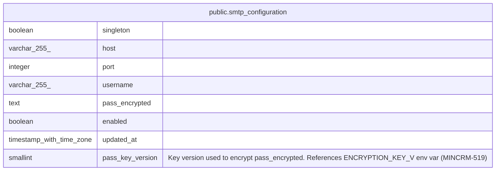

# public.smtp_configuration

## Columns

| Name | Type | Default | Nullable | Children | Parents | Comment |
| ---- | ---- | ------- | -------- | -------- | ------- | ------- |
| singleton | boolean | true | false |  |  |  |
| host | varchar(255) | ''::character varying | false |  |  |  |
| port | integer | 587 | false |  |  |  |
| username | varchar(255) | ''::character varying | false |  |  |  |
| pass_encrypted | text | ''::text | false |  |  |  |
| enabled | boolean | false | false |  |  |  |
| updated_at | timestamp with time zone | now() | false |  |  |  |
| pass_key_version | smallint | 1 | false |  |  | Key version used to encrypt pass_encrypted. References ENCRYPTION_KEY_V\<n\> env var (MINCRM-519) |

## Constraints

| Name | Type | Definition |
| ---- | ---- | ---------- |
| smtp_configuration_singleton | CHECK | CHECK (singleton) |
| smtp_configuration_singleton_unique | UNIQUE | UNIQUE (singleton) |

## Indexes

| Name | Definition |
| ---- | ---------- |
| smtp_configuration_singleton_unique | CREATE UNIQUE INDEX smtp_configuration_singleton_unique ON public.smtp_configuration USING btree (singleton) |

## Relations

---

> Generated by [tbls](https://github.com/k1LoW/tbls)
