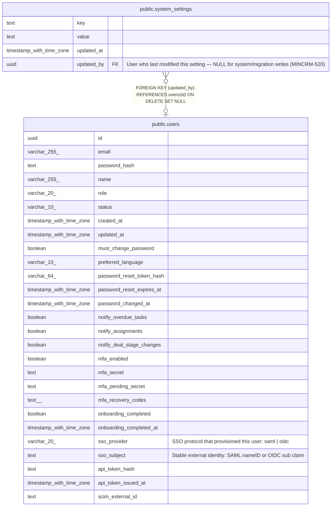

# public.system_settings

## Columns

| Name | Type | Default | Nullable | Children | Parents | Comment |
| ---- | ---- | ------- | -------- | -------- | ------- | ------- |
| key | text |  | false |  |  |  |
| value | text |  | false |  |  |  |
| updated_at | timestamp with time zone | now() | false |  |  |  |
| updated_by | uuid |  | true |  | [public.users](public.users.md) | User who last modified this setting — NULL for system/migration writes (MINCRM-520) |

## Constraints

| Name | Type | Definition |
| ---- | ---- | ---------- |
| system_settings_updated_by_fkey | FOREIGN KEY | FOREIGN KEY (updated_by) REFERENCES users(id) ON DELETE SET NULL |
| system_settings_pkey | PRIMARY KEY | PRIMARY KEY (key) |

## Indexes

| Name | Definition |
| ---- | ---------- |
| system_settings_pkey | CREATE UNIQUE INDEX system_settings_pkey ON public.system_settings USING btree (key) |

## Triggers

| Name | Definition |
| ---- | ---------- |
| system_settings_set_updated_at | CREATE TRIGGER system_settings_set_updated_at BEFORE UPDATE ON public.system_settings FOR EACH ROW EXECUTE FUNCTION set_updated_at() |

## Relations

---

> Generated by [tbls](https://github.com/k1LoW/tbls)
