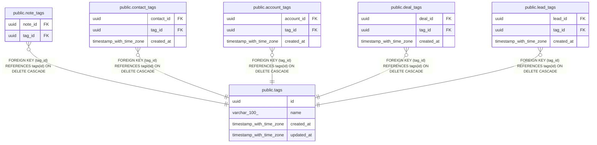

# public.tags

## Columns

| Name | Type | Default | Nullable | Children | Parents | Comment |
| ---- | ---- | ------- | -------- | -------- | ------- | ------- |
| id | uuid | gen_random_uuid() | false | [public.note_tags](public.note_tags.md) [public.contact_tags](public.contact_tags.md) [public.account_tags](public.account_tags.md) [public.deal_tags](public.deal_tags.md) [public.lead_tags](public.lead_tags.md) |  |  |
| name | varchar(100) |  | false |  |  |  |
| created_at | timestamp with time zone | now() | false |  |  |  |
| updated_at | timestamp with time zone | now() | false |  |  |  |

## Constraints

| Name | Type | Definition |
| ---- | ---- | ---------- |
| tags_pkey | PRIMARY KEY | PRIMARY KEY (id) |
| tags_name_key | UNIQUE | UNIQUE (name) |

## Indexes

| Name | Definition |
| ---- | ---------- |
| tags_pkey | CREATE UNIQUE INDEX tags_pkey ON public.tags USING btree (id) |
| tags_name_key | CREATE UNIQUE INDEX tags_name_key ON public.tags USING btree (name) |

## Triggers

| Name | Definition |
| ---- | ---------- |
| tags_set_updated_at | CREATE TRIGGER tags_set_updated_at BEFORE UPDATE ON public.tags FOR EACH ROW EXECUTE FUNCTION set_updated_at() |

## Relations

---

> Generated by [tbls](https://github.com/k1LoW/tbls)
