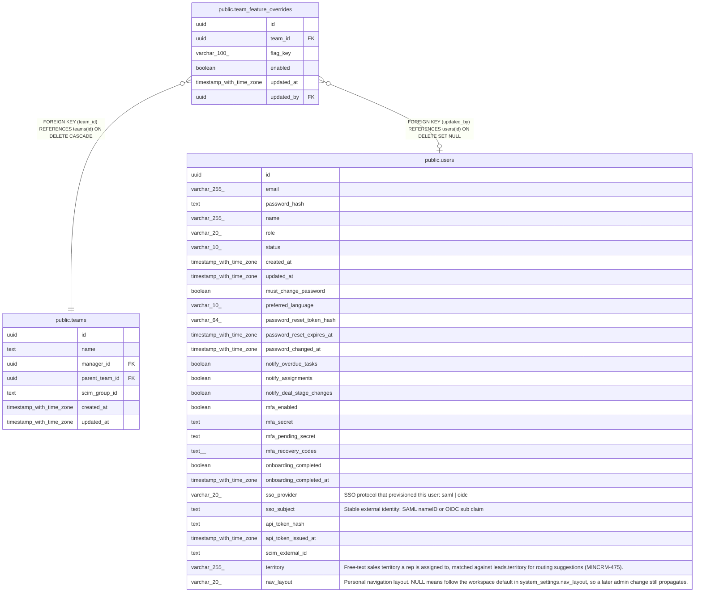

# public.team_feature_overrides

## Description

Per-team feature flag overrides (MINCRM-475). Generic, not routing-specific — any future per-team toggle can reuse this table. enabled=false blocks the flag for every member of the team regardless of rollout/beta/group state, but a per-user force_enabled override in feature_flag_user_overrides still wins (checked first in isFlagEnabledForUser).

## Columns

| Name | Type | Default | Nullable | Children | Parents | Comment |
| ---- | ---- | ------- | -------- | -------- | ------- | ------- |
| id | uuid | gen_random_uuid() | false |  |  |  |
| team_id | uuid |  | false |  | [public.teams](public.teams.md) |  |
| flag_key | varchar(100) |  | false |  |  |  |
| enabled | boolean |  | false |  |  |  |
| updated_at | timestamp with time zone | now() | false |  |  |  |
| updated_by | uuid |  | true |  | [public.users](public.users.md) |  |

## Constraints

| Name | Type | Definition |
| ---- | ---- | ---------- |
| team_feature_overrides_updated_by_fkey | FOREIGN KEY | FOREIGN KEY (updated_by) REFERENCES users(id) ON DELETE SET NULL |
| team_feature_overrides_team_id_fkey | FOREIGN KEY | FOREIGN KEY (team_id) REFERENCES teams(id) ON DELETE CASCADE |
| team_feature_overrides_pkey | PRIMARY KEY | PRIMARY KEY (id) |
| team_feature_overrides_team_flag_unique | UNIQUE | UNIQUE (team_id, flag_key) |

## Indexes

| Name | Definition |
| ---- | ---------- |
| team_feature_overrides_pkey | CREATE UNIQUE INDEX team_feature_overrides_pkey ON public.team_feature_overrides USING btree (id) |
| team_feature_overrides_team_flag_unique | CREATE UNIQUE INDEX team_feature_overrides_team_flag_unique ON public.team_feature_overrides USING btree (team_id, flag_key) |
| team_feature_overrides_flag_key_idx | CREATE INDEX team_feature_overrides_flag_key_idx ON public.team_feature_overrides USING btree (flag_key) |

## Relations

---

> Generated by [tbls](https://github.com/k1LoW/tbls)
