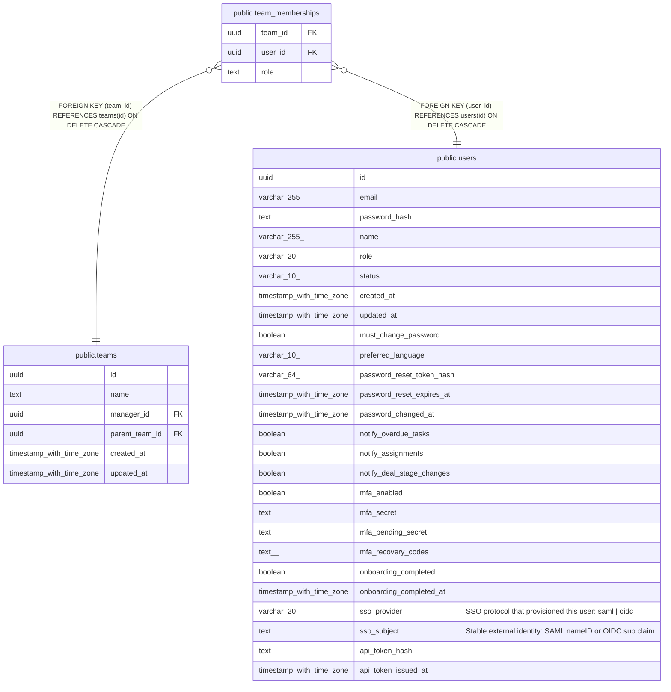

# public.team_memberships

## Columns

| Name | Type | Default | Nullable | Children | Parents | Comment |
| ---- | ---- | ------- | -------- | -------- | ------- | ------- |
| team_id | uuid |  | false |  | [public.teams](public.teams.md) |  |
| user_id | uuid |  | false |  | [public.users](public.users.md) |  |
| role | text |  | false |  |  |  |

## Constraints

| Name | Type | Definition |
| ---- | ---- | ---------- |
| team_memberships_role_check | CHECK | CHECK ((role = ANY (ARRAY['lead'::text, 'member'::text]))) |
| team_memberships_user_id_fkey | FOREIGN KEY | FOREIGN KEY (user_id) REFERENCES users(id) ON DELETE CASCADE |
| team_memberships_team_id_fkey | FOREIGN KEY | FOREIGN KEY (team_id) REFERENCES teams(id) ON DELETE CASCADE |
| team_memberships_pkey | PRIMARY KEY | PRIMARY KEY (team_id, user_id) |

## Indexes

| Name | Definition |
| ---- | ---------- |
| team_memberships_pkey | CREATE UNIQUE INDEX team_memberships_pkey ON public.team_memberships USING btree (team_id, user_id) |
| team_memberships_user_id_idx | CREATE INDEX team_memberships_user_id_idx ON public.team_memberships USING btree (user_id) |

## Relations

---

> Generated by [tbls](https://github.com/k1LoW/tbls)
