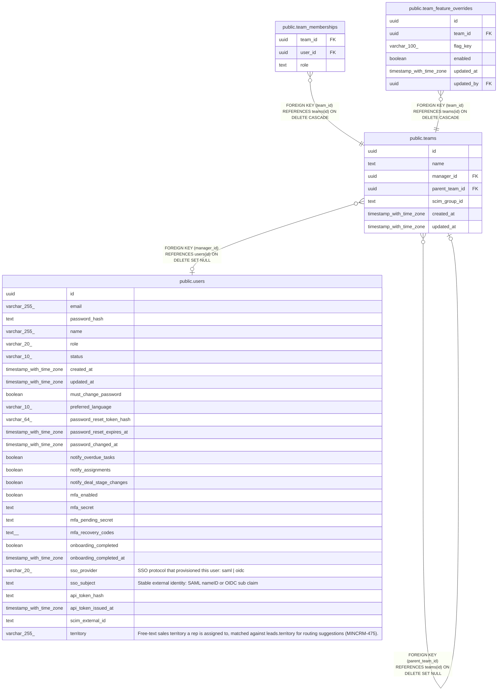

# public.teams

## Columns

| Name | Type | Default | Nullable | Children | Parents | Comment |
| ---- | ---- | ------- | -------- | -------- | ------- | ------- |
| id | uuid | gen_random_uuid() | false | [public.teams](public.teams.md) [public.team_memberships](public.team_memberships.md) [public.team_feature_overrides](public.team_feature_overrides.md) |  |  |
| name | text |  | false |  |  |  |
| manager_id | uuid |  | true |  | [public.users](public.users.md) |  |
| parent_team_id | uuid |  | true |  | [public.teams](public.teams.md) |  |
| scim_group_id | text |  | true |  |  |  |
| created_at | timestamp with time zone | now() | false |  |  |  |
| updated_at | timestamp with time zone | now() | false |  |  |  |

## Constraints

| Name | Type | Definition |
| ---- | ---- | ---------- |
| teams_manager_id_fkey | FOREIGN KEY | FOREIGN KEY (manager_id) REFERENCES users(id) ON DELETE SET NULL |
| teams_parent_team_id_fkey | FOREIGN KEY | FOREIGN KEY (parent_team_id) REFERENCES teams(id) ON DELETE SET NULL |
| teams_pkey | PRIMARY KEY | PRIMARY KEY (id) |
| teams_name_key | UNIQUE | UNIQUE (name) |
| teams_scim_group_id_key | UNIQUE | UNIQUE (scim_group_id) |

## Indexes

| Name | Definition |
| ---- | ---------- |
| teams_pkey | CREATE UNIQUE INDEX teams_pkey ON public.teams USING btree (id) |
| teams_name_key | CREATE UNIQUE INDEX teams_name_key ON public.teams USING btree (name) |
| teams_scim_group_id_key | CREATE UNIQUE INDEX teams_scim_group_id_key ON public.teams USING btree (scim_group_id) |
| teams_name_lower_idx | CREATE UNIQUE INDEX teams_name_lower_idx ON public.teams USING btree (lower(name)) |

## Triggers

| Name | Definition |
| ---- | ---------- |
| teams_set_updated_at | CREATE TRIGGER teams_set_updated_at BEFORE UPDATE ON public.teams FOR EACH ROW EXECUTE FUNCTION set_updated_at() |

## Relations

---

> Generated by [tbls](https://github.com/k1LoW/tbls)
