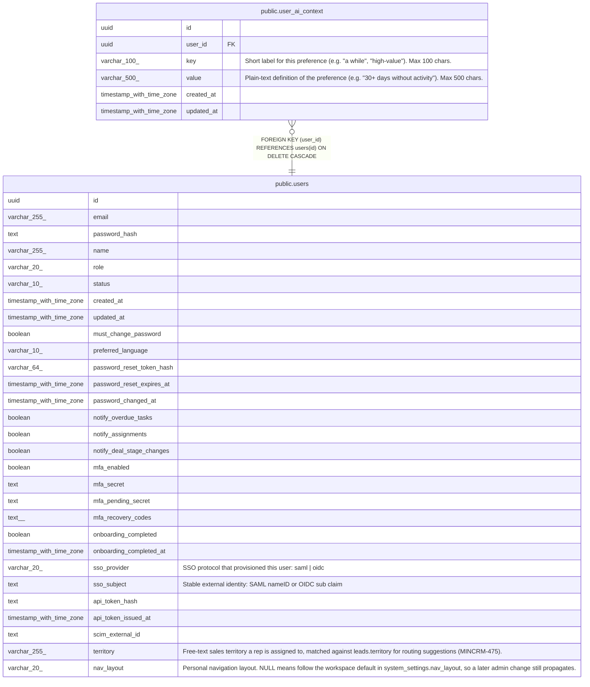

# public.user_ai_context

## Description

Per-user key/value context entries injected into every Claude system prompt as a personalisation preamble. (MINCRM-427)

## Columns

| Name | Type | Default | Nullable | Children | Parents | Comment |
| ---- | ---- | ------- | -------- | -------- | ------- | ------- |
| id | uuid | gen_random_uuid() | false |  |  |  |
| user_id | uuid |  | false |  | [public.users](public.users.md) |  |
| key | varchar(100) |  | false |  |  | Short label for this preference (e.g. "a while", "high-value"). Max 100 chars. |
| value | varchar(500) |  | false |  |  | Plain-text definition of the preference (e.g. "30+ days without activity"). Max 500 chars. |
| created_at | timestamp with time zone | now() | false |  |  |  |
| updated_at | timestamp with time zone | now() | false |  |  |  |

## Constraints

| Name | Type | Definition |
| ---- | ---- | ---------- |
| user_ai_context_user_id_fkey | FOREIGN KEY | FOREIGN KEY (user_id) REFERENCES users(id) ON DELETE CASCADE |
| user_ai_context_pkey | PRIMARY KEY | PRIMARY KEY (id) |
| user_ai_context_user_id_key_unique | UNIQUE | UNIQUE (user_id, key) |

## Indexes

| Name | Definition |
| ---- | ---------- |
| user_ai_context_pkey | CREATE UNIQUE INDEX user_ai_context_pkey ON public.user_ai_context USING btree (id) |
| user_ai_context_user_id_idx | CREATE INDEX user_ai_context_user_id_idx ON public.user_ai_context USING btree (user_id) |
| user_ai_context_user_id_key_unique | CREATE UNIQUE INDEX user_ai_context_user_id_key_unique ON public.user_ai_context USING btree (user_id, key) |

## Triggers

| Name | Definition |
| ---- | ---------- |
| user_ai_context_set_updated_at | CREATE TRIGGER user_ai_context_set_updated_at BEFORE UPDATE ON public.user_ai_context FOR EACH ROW EXECUTE FUNCTION set_updated_at() |

## Relations

---

> Generated by [tbls](https://github.com/k1LoW/tbls)
