# public.users

## Columns

| Name | Type | Default | Nullable | Children | Parents | Comment |
| ---- | ---- | ------- | -------- | -------- | ------- | ------- |
| id | uuid | gen_random_uuid() | false | [public.contacts](public.contacts.md) [public.accounts](public.accounts.md) [public.deals](public.deals.md) [public.activities](public.activities.md) [public.system_settings](public.system_settings.md) [public.automation_rules](public.automation_rules.md) [public.attachments](public.attachments.md) [public.leads](public.leads.md) [public.import_jobs](public.import_jobs.md) [public.webhook_subscriptions](public.webhook_subscriptions.md) [public.notes](public.notes.md) [public.gdpr_deletion_log](public.gdpr_deletion_log.md) [public.pipelines](public.pipelines.md) [public.custom_reports](public.custom_reports.md) [public.sales_sequences](public.sales_sequences.md) [public.sequence_enrollments](public.sequence_enrollments.md) [public.feature_flags](public.feature_flags.md) [public.feature_flag_usage](public.feature_flag_usage.md) [public.ai_token_budgets](public.ai_token_budgets.md) [public.ai_token_usage](public.ai_token_usage.md) [public.ai_configuration](public.ai_configuration.md) |  |  |
| email | varchar(255) |  | false |  |  |  |
| password_hash | text |  | true |  |  |  |
| name | varchar(255) |  | false |  |  |  |
| role | varchar(10) | '''rep'''::character varying | false |  |  |  |
| status | varchar(10) | '''active'''::character varying | false |  |  |  |
| created_at | timestamp with time zone | now() | false |  |  |  |
| updated_at | timestamp with time zone | now() | false |  |  |  |
| must_change_password | boolean | false | false |  |  |  |
| preferred_language | varchar(10) | NULL::character varying | true |  |  |  |
| password_reset_token_hash | varchar(64) | NULL::character varying | true |  |  |  |
| password_reset_expires_at | timestamp with time zone |  | true |  |  |  |
| password_changed_at | timestamp with time zone |  | true |  |  |  |
| notify_overdue_tasks | boolean | true | false |  |  |  |
| notify_assignments | boolean | true | false |  |  |  |
| notify_deal_stage_changes | boolean | true | false |  |  |  |
| mfa_enabled | boolean | false | false |  |  |  |
| mfa_secret | text |  | true |  |  |  |
| mfa_pending_secret | text |  | true |  |  |  |
| mfa_recovery_codes | text[] | '{}'::text[] | false |  |  |  |
| onboarding_completed | boolean | false | false |  |  |  |
| onboarding_completed_at | timestamp with time zone |  | true |  |  |  |
| sso_provider | varchar(20) | NULL::character varying | true |  |  | SSO protocol that provisioned this user: saml \| oidc |
| sso_subject | text |  | true |  |  | Stable external identity: SAML nameID or OIDC sub claim |

## Constraints

| Name | Type | Definition |
| ---- | ---- | ---------- |
| users_role_check | CHECK | CHECK (((role)::text = ANY ((ARRAY['admin'::character varying, 'rep'::character varying])::text[]))) |
| users_sso_provider_requires_subject | CHECK | CHECK (((sso_provider IS NULL) OR (sso_subject IS NOT NULL))) |
| users_sso_subject_max_length | CHECK | CHECK (((sso_subject IS NULL) OR (length(sso_subject) <= 1024))) |
| users_status_check | CHECK | CHECK (((status)::text = ANY ((ARRAY['active'::character varying, 'invited'::character varying, 'inactive'::character varying])::text[]))) |
| users_pkey | PRIMARY KEY | PRIMARY KEY (id) |
| users_email_key | UNIQUE | UNIQUE (email) |

## Indexes

| Name | Definition |
| ---- | ---------- |
| users_pkey | CREATE UNIQUE INDEX users_pkey ON public.users USING btree (id) |
| users_email_key | CREATE UNIQUE INDEX users_email_key ON public.users USING btree (email) |
| users_email_index | CREATE INDEX users_email_index ON public.users USING btree (email) |
| users_password_reset_token_hash_idx | CREATE INDEX users_password_reset_token_hash_idx ON public.users USING btree (password_reset_token_hash) WHERE (password_reset_token_hash IS NOT NULL) |
| users_sso_provider_sso_subject_unique | CREATE UNIQUE INDEX users_sso_provider_sso_subject_unique ON public.users USING btree (sso_provider, sso_subject) WHERE (sso_subject IS NOT NULL) |

## Triggers

| Name | Definition |
| ---- | ---------- |
| users_set_updated_at | CREATE TRIGGER users_set_updated_at BEFORE UPDATE ON public.users FOR EACH ROW EXECUTE FUNCTION set_updated_at() |

## Relations

```mermaid
erDiagram

"public.contacts" }o--|| "public.users" : "FOREIGN KEY (owner_id) REFERENCES users(id) ON DELETE RESTRICT"
"public.accounts" }o--|| "public.users" : "FOREIGN KEY (owner_id) REFERENCES users(id) ON DELETE RESTRICT"
"public.deals" }o--|| "public.users" : "FOREIGN KEY (owner_id) REFERENCES users(id) ON DELETE RESTRICT"
"public.activities" }o--|| "public.users" : "FOREIGN KEY (owner_id) REFERENCES users(id) ON DELETE RESTRICT"
"public.system_settings" }o--o| "public.users" : "FOREIGN KEY (updated_by) REFERENCES users(id) ON DELETE SET NULL"
"public.automation_rules" }o--|| "public.users" : "FOREIGN KEY (created_by) REFERENCES users(id) ON DELETE RESTRICT"
"public.attachments" }o--o| "public.users" : "FOREIGN KEY (uploader_id) REFERENCES users(id) ON DELETE SET NULL"
"public.leads" }o--|| "public.users" : "FOREIGN KEY (owner_id) REFERENCES users(id) ON DELETE RESTRICT"
"public.import_jobs" }o--o| "public.users" : "FOREIGN KEY (created_by) REFERENCES users(id) ON DELETE SET NULL"
"public.webhook_subscriptions" }o--o| "public.users" : "FOREIGN KEY (created_by) REFERENCES users(id) ON DELETE SET NULL"
"public.notes" }o--|| "public.users" : "FOREIGN KEY (created_by) REFERENCES users(id)"
"public.notes" }o--o| "public.users" : "FOREIGN KEY (updated_by) REFERENCES users(id)"
"public.gdpr_deletion_log" }o--|| "public.users" : "FOREIGN KEY (requested_by) REFERENCES users(id)"
"public.pipelines" }o--o| "public.users" : "FOREIGN KEY (created_by) REFERENCES users(id) ON DELETE SET NULL"
"public.custom_reports" }o--o| "public.users" : "FOREIGN KEY (created_by) REFERENCES users(id) ON DELETE SET NULL"
"public.sales_sequences" }o--o| "public.users" : "FOREIGN KEY (created_by) REFERENCES users(id) ON DELETE SET NULL"
"public.sequence_enrollments" }o--o| "public.users" : "FOREIGN KEY (enrolled_by_id) REFERENCES users(id) ON DELETE SET NULL"
"public.feature_flags" }o--o| "public.users" : "FOREIGN KEY (updated_by) REFERENCES users(id) ON DELETE SET NULL"
"public.feature_flag_usage" }o--|| "public.users" : "FOREIGN KEY (user_id) REFERENCES users(id) ON DELETE CASCADE"
"public.ai_token_budgets" }o--o| "public.users" : "FOREIGN KEY (user_id) REFERENCES users(id) ON DELETE CASCADE"
"public.ai_token_usage" }o--|| "public.users" : "FOREIGN KEY (user_id) REFERENCES users(id) ON DELETE CASCADE"
"public.ai_configuration" }o--o| "public.users" : "FOREIGN KEY (dpa_acknowledged_by) REFERENCES users(id) ON DELETE SET NULL"
"public.ai_configuration" }o--o| "public.users" : "FOREIGN KEY (updated_by) REFERENCES users(id) ON DELETE SET NULL"

"public.users" {
  uuid id ""
  varchar_255_ email ""
  text password_hash ""
  varchar_255_ name ""
  varchar_10_ role ""
  varchar_10_ status ""
  timestamp_with_time_zone created_at ""
  timestamp_with_time_zone updated_at ""
  boolean must_change_password ""
  varchar_10_ preferred_language ""
  varchar_64_ password_reset_token_hash ""
  timestamp_with_time_zone password_reset_expires_at ""
  timestamp_with_time_zone password_changed_at ""
  boolean notify_overdue_tasks ""
  boolean notify_assignments ""
  boolean notify_deal_stage_changes ""
  boolean mfa_enabled ""
  text mfa_secret ""
  text mfa_pending_secret ""
  text__ mfa_recovery_codes ""
  boolean onboarding_completed ""
  timestamp_with_time_zone onboarding_completed_at ""
  varchar_20_ sso_provider "SSO protocol that provisioned this user: saml | oidc"
  text sso_subject "Stable external identity: SAML nameID or OIDC sub claim"
}
"public.contacts" {
  uuid id ""
  varchar_255_ first_name ""
  varchar_255_ last_name ""
  varchar_255_ email ""
  varchar_50_ phone ""
  varchar_255_ title ""
  varchar_255_ department ""
  uuid owner_id FK ""
  timestamp_with_time_zone created_at ""
  timestamp_with_time_zone updated_at ""
  uuid account_id FK ""
  boolean is_demo ""
  uuid source_lead_id FK ""
  varchar_500_ linkedin_url ""
  varchar_500_ twitter_x_url ""
  varchar_500_ other_url ""
  integer version ""
}
"public.accounts" {
  uuid id ""
  varchar_255_ name ""
  varchar_255_ industry ""
  varchar_255_ website ""
  varchar_50_ employee_range ""
  varchar_50_ revenue_range ""
  uuid owner_id FK ""
  timestamp_with_time_zone created_at ""
  timestamp_with_time_zone updated_at ""
  boolean is_demo ""
  varchar_20_ account_type ""
  uuid parent_account_id FK ""
  integer version ""
}
"public.deals" {
  uuid id ""
  varchar_255_ name ""
  varchar_50_ stage ""
  numeric_15_2_ value ""
  date close_date ""
  text loss_reason ""
  uuid account_id FK ""
  uuid owner_id FK ""
  timestamp_with_time_zone created_at ""
  timestamp_with_time_zone updated_at ""
  boolean is_demo ""
  uuid source_lead_id FK ""
  integer probability ""
  varchar_3_ currency ""
  integer version ""
  uuid pipeline_id FK ""
  uuid pipeline_stage_id FK ""
}
"public.activities" {
  uuid id ""
  activity_type type ""
  varchar_255_ subject ""
  text notes ""
  date due_date ""
  activity_status status ""
  uuid contact_id FK ""
  uuid account_id FK ""
  uuid deal_id FK ""
  uuid owner_id FK ""
  timestamp_with_time_zone created_at ""
  timestamp_with_time_zone updated_at ""
  activity_direction direction ""
  text outcome ""
  boolean is_demo ""
  integer version ""
  jsonb metadata ""
}
"public.system_settings" {
  text key ""
  text value ""
  timestamp_with_time_zone updated_at ""
  uuid updated_by FK "User who last modified this setting — NULL for system/migration writes (MINCRM-520)"
}
"public.automation_rules" {
  uuid id ""
  varchar_255_ name ""
  boolean enabled ""
  automation_trigger_type trigger_type ""
  jsonb trigger_config ""
  automation_action_type action_type ""
  jsonb action_config ""
  uuid created_by FK ""
  timestamp_with_time_zone created_at ""
  timestamp_with_time_zone updated_at ""
  boolean is_demo ""
}
"public.attachments" {
  uuid id ""
  text record_type ""
  uuid record_id ""
  text filename ""
  bigint file_size ""
  text mime_type ""
  text storage_key ""
  uuid uploader_id FK ""
  timestamp_with_time_zone uploaded_at ""
}
"public.leads" {
  uuid id ""
  text first_name ""
  text last_name ""
  text email ""
  text phone ""
  text company_name ""
  text lead_source ""
  text status ""
  text disqualification_reason ""
  text notes ""
  uuid owner_id FK ""
  timestamp_with_time_zone converted_at ""
  uuid converted_contact_id FK ""
  uuid converted_account_id FK ""
  uuid converted_deal_id FK ""
  timestamp_with_time_zone created_at ""
  timestamp_with_time_zone updated_at ""
  boolean is_demo ""
  integer version ""
}
"public.import_jobs" {
  uuid id ""
  varchar_16_ type ""
  varchar_16_ status ""
  integer total_rows ""
  integer processed_rows ""
  integer created_count ""
  integer skipped_count ""
  integer failed_count ""
  text error_csv ""
  uuid created_by FK ""
  timestamp_with_time_zone started_at ""
  timestamp_with_time_zone completed_at ""
  timestamp_with_time_zone created_at ""
  timestamp_with_time_zone updated_at ""
}
"public.webhook_subscriptions" {
  uuid id ""
  text url ""
  text__ events ""
  text secret_hash ""
  varchar_16_ status ""
  uuid created_by FK ""
  timestamp_with_time_zone created_at ""
}
"public.notes" {
  uuid id ""
  varchar_16_ entity_type ""
  uuid entity_id ""
  varchar_255_ title ""
  text body ""
  text body_text ""
  varchar_8_ visibility ""
  uuid created_by FK ""
  uuid updated_by FK ""
  timestamp_with_time_zone created_at ""
  timestamp_with_time_zone updated_at ""
  timestamp_with_time_zone deleted_at ""
}
"public.gdpr_deletion_log" {
  uuid id ""
  text record_type ""
  uuid record_id "UUID of the erased record. References the PK of the entity identified by record_type. No FK constraint — the referenced row will have been hard-deleted before or during erasure. UNIQUE constraint assumption: safe only while all record IDs are gen_random_uuid() UUIDs. See migration 084 if deterministic external IDs are introduced."
  uuid requested_by FK ""
  timestamp_with_time_zone requested_at ""
  timestamp_with_time_zone completed_at ""
  text__ erasure_scope ""
  text notes ""
}
"public.pipelines" {
  uuid id ""
  varchar_100_ name ""
  boolean is_default ""
  uuid created_by FK ""
  timestamp_with_time_zone created_at ""
  timestamp_with_time_zone updated_at ""
}
"public.custom_reports" {
  uuid id ""
  varchar_200_ name ""
  varchar_16_ entity_type ""
  jsonb config ""
  uuid created_by FK ""
  timestamp_with_time_zone created_at ""
  timestamp_with_time_zone updated_at ""
  varchar_16_ visibility ""
}
"public.sales_sequences" {
  uuid id ""
  varchar_200_ name ""
  text description ""
  boolean enabled ""
  uuid created_by FK ""
  timestamp_with_time_zone created_at ""
  timestamp_with_time_zone updated_at ""
  boolean is_demo ""
}
"public.sequence_enrollments" {
  uuid id ""
  uuid sequence_id FK ""
  uuid contact_id FK ""
  uuid enrolled_by_id FK ""
  timestamp_with_time_zone enrolled_at ""
  varchar_16_ status ""
  uuid current_step_id FK ""
  timestamp_with_time_zone next_action_at ""
  timestamp_with_time_zone unenrolled_at ""
  timestamp_with_time_zone created_at ""
  timestamp_with_time_zone updated_at ""
}
"public.feature_flags" {
  varchar_100_ flag_key ""
  varchar_100_ label ""
  text description ""
  varchar_50_ category ""
  boolean enabled ""
  jsonb role_overrides "Transitional column: per-role enable/disable overrides. Keys must be valid role names (admin, rep), values are booleans. Will be superseded by MINCRM-487 targeting tables and dropped once that epic is live."
  uuid updated_by FK ""
  timestamp_with_time_zone updated_at ""
  boolean system_flag ""
}
"public.feature_flag_usage" {
  varchar_100_ flag_key FK ""
  uuid user_id FK ""
  timestamp_with_time_zone used_at ""
}
"public.ai_token_budgets" {
  uuid id ""
  uuid user_id FK ""
  bigint monthly_limit ""
  timestamp_with_time_zone created_at ""
  timestamp_with_time_zone updated_at ""
}
"public.ai_token_usage" {
  uuid user_id FK ""
  character_7_ year_month ""
  bigint input_tokens ""
  bigint output_tokens ""
  timestamp_with_time_zone updated_at ""
}
"public.ai_configuration" {
  boolean singleton ""
  varchar_50_ provider ""
  varchar_100_ model ""
  text api_key_encrypted ""
  varchar_30_ deployment_mode ""
  text base_url ""
  boolean enabled ""
  timestamp_with_time_zone enabled_updated_at ""
  boolean dpa_acknowledged ""
  uuid dpa_acknowledged_by FK ""
  timestamp_with_time_zone dpa_acknowledged_at ""
  varchar_50_ dpa_acknowledged_for_provider ""
  text custom_dpa_url ""
  timestamp_with_time_zone updated_at ""
  uuid updated_by FK ""
  smallint api_key_key_version "Key version used to encrypt api_key_encrypted. References ENCRYPTION_KEY_V<n> env var (MINCRM-519)"
}
```

---

> Generated by [tbls](https://github.com/k1LoW/tbls)
