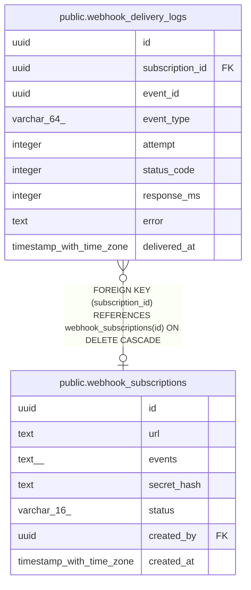

# public.webhook_delivery_logs

## Columns

| Name | Type | Default | Nullable | Children | Parents | Comment |
| ---- | ---- | ------- | -------- | -------- | ------- | ------- |
| id | uuid | gen_random_uuid() | false |  |  |  |
| subscription_id | uuid |  | true |  | [public.webhook_subscriptions](public.webhook_subscriptions.md) |  |
| event_id | uuid |  | false |  |  |  |
| event_type | varchar(64) |  | false |  |  |  |
| attempt | integer | 1 | false |  |  |  |
| status_code | integer |  | true |  |  |  |
| response_ms | integer |  | true |  |  |  |
| error | text |  | true |  |  |  |
| delivered_at | timestamp with time zone | now() | false |  |  |  |

## Constraints

| Name | Type | Definition |
| ---- | ---- | ---------- |
| webhook_delivery_logs_subscription_id_fkey | FOREIGN KEY | FOREIGN KEY (subscription_id) REFERENCES webhook_subscriptions(id) ON DELETE CASCADE |
| webhook_delivery_logs_pkey | PRIMARY KEY | PRIMARY KEY (id) |

## Indexes

| Name | Definition |
| ---- | ---------- |
| webhook_delivery_logs_pkey | CREATE UNIQUE INDEX webhook_delivery_logs_pkey ON public.webhook_delivery_logs USING btree (id) |
| webhook_delivery_logs_subscription_id_index | CREATE INDEX webhook_delivery_logs_subscription_id_index ON public.webhook_delivery_logs USING btree (subscription_id) |
| webhook_delivery_logs_event_id_index | CREATE INDEX webhook_delivery_logs_event_id_index ON public.webhook_delivery_logs USING btree (event_id) |
| webhook_delivery_logs_delivered_at_idx | CREATE INDEX webhook_delivery_logs_delivered_at_idx ON public.webhook_delivery_logs USING btree (delivered_at) |

## Relations

---

> Generated by [tbls](https://github.com/k1LoW/tbls)
