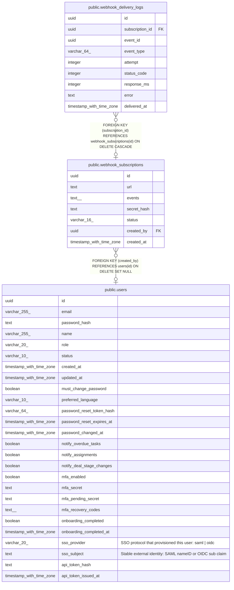

# public.webhook_subscriptions

## Columns

| Name | Type | Default | Nullable | Children | Parents | Comment |
| ---- | ---- | ------- | -------- | -------- | ------- | ------- |
| id | uuid | gen_random_uuid() | false | [public.webhook_delivery_logs](public.webhook_delivery_logs.md) |  |  |
| url | text |  | false |  |  |  |
| events | text[] |  | false |  |  |  |
| secret_hash | text |  | false |  |  |  |
| status | varchar(16) | 'active'::character varying | false |  |  |  |
| created_by | uuid |  | true |  | [public.users](public.users.md) |  |
| created_at | timestamp with time zone | now() | false |  |  |  |

## Constraints

| Name | Type | Definition |
| ---- | ---- | ---------- |
| webhook_subscriptions_status_check | CHECK | CHECK (((status)::text = ANY ((ARRAY['active'::character varying, 'failed'::character varying, 'disabled'::character varying])::text[]))) |
| webhook_subscriptions_created_by_fkey | FOREIGN KEY | FOREIGN KEY (created_by) REFERENCES users(id) ON DELETE SET NULL |
| webhook_subscriptions_pkey | PRIMARY KEY | PRIMARY KEY (id) |

## Indexes

| Name | Definition |
| ---- | ---------- |
| webhook_subscriptions_pkey | CREATE UNIQUE INDEX webhook_subscriptions_pkey ON public.webhook_subscriptions USING btree (id) |

## Relations

---

> Generated by [tbls](https://github.com/k1LoW/tbls)
