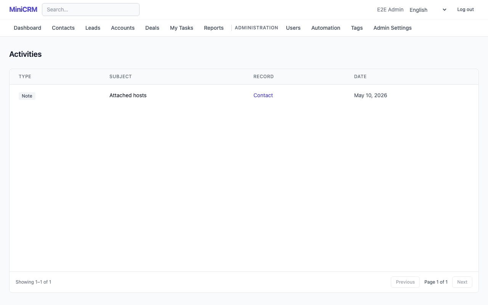

# Activities

> **Feature flag:** The **Activities** flag hides the activity timeline on contact,
> account, and deal detail pages. It also disables the task list: the **My Tasks**
> navigation entry stays visible, but the page can only show an error while the flag is
> off. If you hit that, ask your admin to check the **Activities** flag.

Activities are records of interactions with contacts — calls, emails, meetings, and
tasks. They build up a timeline on each contact, account, and deal so everyone on the
team can see the history at a glance.

---

## Tutorial: log a call and create a follow-up task

### Step 1 — Log a call

1. Open the contact, account, or deal the call was about.
2. In the **Activities** timeline, click **Log activity**.
3. Set **Type** to _Call_.
4. Set **Direction** to _Outbound_ (you called them) or _Inbound_ (they called you).
5. Set **Status** to _Complete_ — the call already happened.
6. Optionally add an **Outcome** summary (e.g. "Left voicemail") and link to a deal.
7. Click **Save**. The call appears in the timeline immediately.

### Step 2 — Create a follow-up task

1. In the same Activities timeline, click **Log activity** again.
2. Set **Type** to _Task_.
3. Give it a **Subject** (e.g. "Send pricing proposal").
4. Set **Status** to _Open_ — this task still needs to be done.
5. Set a **Due date** so it appears in your task list and triggers overdue reminders.
6. Click **Save**.

### Step 3 — Complete the task

When you finish the follow-up:

1. Open the activity from the timeline, or find it on [My Tasks](my-tasks.md).
2. Click **Mark complete** (or edit the activity and set **Status** to _Complete_).

---

## Reference

### Activity types

| Type    | Use for                                                                     |
| ------- | --------------------------------------------------------------------------- |
| Note    | A quick logged note (see also the dedicated Notes feature for richer notes) |
| Call    | Phone or video call                                                         |
| Email   | An email sent or received                                                   |
| Meeting | In-person or virtual meeting                                                |
| Task    | A to-do item with a due date                                                |

### Fields

| Field                    | Notes                                                  |
| ------------------------ | ------------------------------------------------------ |
| Type                     | Required; see table above                              |
| Subject                  | Short description of the activity                      |
| Status                   | _Open_ (to do) or _Complete_ (done)                    |
| Direction                | _Inbound_ or _Outbound_; relevant for calls and emails |
| Outcome                  | Free-text result summary                               |
| Due date                 | For tasks; triggers overdue notifications              |
| Owner                    | The rep responsible; defaults to the creator           |
| Contact / Account / Deal | At least one must be linked                            |

### My Tasks

**My Tasks** in the navigation lists the open tasks assigned to you and lets you mark them
complete. See [My Tasks](my-tasks.md).

### Overdue notifications

If your admin has enabled email notifications, you will receive a daily digest of
overdue tasks (tasks past their due date that are still open). You can control this
in your notification preferences — see [Profile Settings](profile.md).

### AI Objection Pattern Matching

> **Feature flag:** `ai_objection_pattern_matching`.

When an activity has note text, MiniCRM automatically checks whether the note logs a
sales objection and, if so, shows a small category badge next to it in the timeline:
**Price**, **Timing**, **Competitor**, **Product Fit**, **Authority**, **Risk**, or
**Other**. Hover the badge to see a reminder that the category is AI-inferred. Not
every note is classified — only ones that clearly describe an objection the contact
raised.

Click **How was this handled before?** below the badge to see up to three similar
objections from past deals your team won, each showing:

- The deal it came from (click through to view it).
- A quote of the past objection.
- What the rep did next (the following logged activity on that deal).
- How many days later the deal closed.

If your organisation does not yet have enough won-deal history, the panel tells you how
many more closed-won deals are needed before precedents can be shown.

> The category and matched precedents are **AI-inferred** — use them as a quick
> reference for how similar pushback has been handled before, not as a guarantee that
> the same approach will work again.

### AI call/note summarizer

> **Feature flag:** `ai_activity_summarizer`.

On the activity create/edit form and detail view, click **Summarize** for Call,
Meeting, or Note activities to paste a call transcript, raw meeting notes, or a
recording transcript. MiniCRM generates:

- A 2-4 sentence summary.
- A bulleted list of action items.
- Up to three suggested follow-up tasks, each with a suggested due date.

The result is shown as an editable preview — nothing is saved until you apply it.
Applying populates the activity's notes field with the summary and appends the action
items. Suggested tasks can be accepted individually (creating a Task activity linked to
the same contact or account) or dismissed without creating anything.

### AI follow-up task suggestions

> **Feature flag:** `ai_task_suggestions`.

After you save a Call, Meeting, or Email activity, MiniCRM may show a **Suggested
follow-up tasks** panel with one to three AI-suggested next steps, each with a
description, suggested due date, and the entity (contact or opportunity) it would link
to. Click **Add Task** to create the task as shown, or **Dismiss** to discard a
suggestion without creating anything. The panel only appears once, right after saving —
it is not regenerated if you reload the page.

### AI Draft Email

> **Feature flag:** `ai_email_draft`.

See [Contacts — AI Draft Email](contacts.md#ai-draft-email) — the same action is
available from an activity's detail view for any activity linked to a contact.

> These suggestions are **AI-generated** from the activity's own text — review before
> saving or acting on them.

### AI pre-meeting brief

> **Feature flag:** `ai_meeting_brief`.

For any upcoming Call or Meeting activity linked to a contact, a **Generate Brief**
button appears in the activity timeline. Click it to assemble a brief covering the
contact's snapshot (name, title, company), a short account summary, open opportunities
with an AI-suggested next step for each, a plain-language summary of recent activity,
3–5 suggested talking points, and any objection categories previously logged for the
contact. If your admin has enabled web search in AI settings, the brief may also
include up to two recent news items about the contact's company — this section is
omitted (not shown as an error) when no relevant news is found or the search fails.
When enough interaction history exists, the brief also includes the contact's
[smart follow-up timing suggestion](contacts.md#ai-smart-follow-up-timing-suggestions).

The brief opens in a sidebar panel with **Copy to clipboard**, **Print**, and
**Regenerate** actions — regenerating replaces the previous brief rather than keeping
both. The most recently generated brief for an activity is also available at its own
page (`/activities/<id>/brief`) so you can pull it up on your phone right before a
call — like every other page in MiniCRM, this still requires being logged in.
